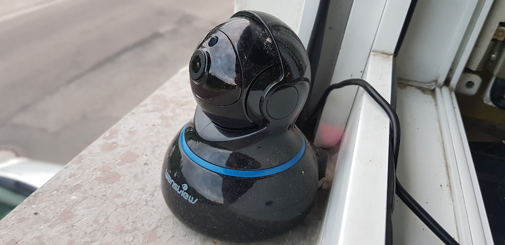

An affordable installation for observing the local weather situation and streaming to Youtube.

## Requirements

- FullHD RTSP stream
- Affordable hardware components
- Easy installation

## Hardware

- [Raspberry Pi 3 Model B](https://www.raspberrypi.org/products/raspberry-pi-3-model-b-plus/) with a 8GB Micro SD
- [Wansview 1080P](https://www.wansview.com/cn/proinfo.aspx?proid=28&categoryid=4&aids=1) IP camera, bought on Amazon for 49.99€
- Micro USB power supplies

## Software

- [Raspian 9 Strech](https://www.raspberrypi.org/downloads/raspbian/) with [Docker CE](https://docs.docker.com/install/linux/docker-ce/debian/)
- Datarhei Restreamer

## Setup

The camera is an indoor camera, but it is mounted in front of the window on the outside. The power cord is
going from the power supply through the frame of the window to the camera. The camera has a WLAN connection
to the internet router.

The Raspberry Pi is inside and connected to the same router and is running Restreamer in a Docker container.
The Restreamer pulls the RTSP stream from the camera and pushes it to Youtube:

[Live Wettercam aus Hördt / Rheinland Pfalz](https://www.youtube.com/channel/UCKug4xem96If14UAgWSJ6ow)

On Youtube, the live stream is setup as an event without an ending time. This is more resilient to interruptions than
pushing the stream to "Stream now" and will not create a new video ID on short interruptions (e.g. rebooting the camera
or the internet router).
