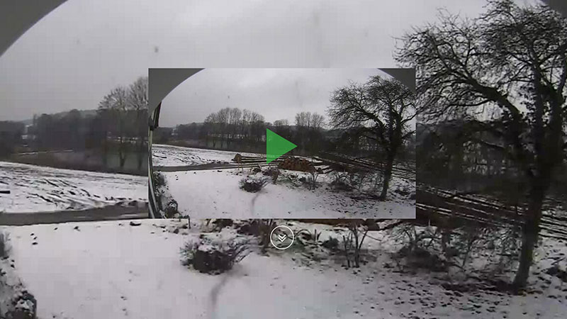
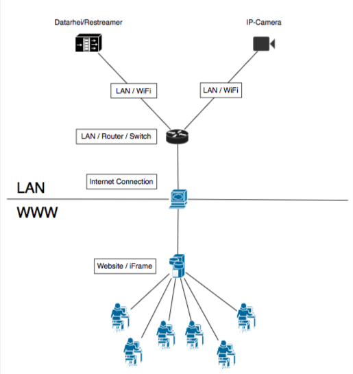
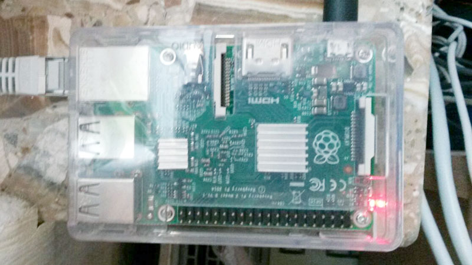
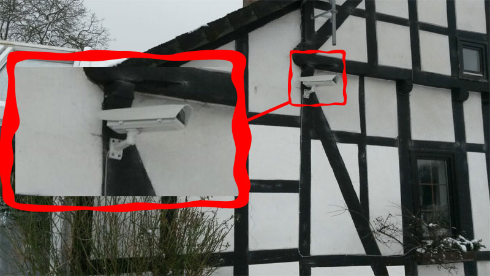

###### [Demo](../docs/demo-index.html) > Case Study Demo >> Case Study 6
# Case Study 6
Projects done with Datarhei/Restreamer

### Raspberry Pi 2 with weatherstation streaming IP camera
### Mission  
Streaming a backyard with a Raspberry Pi2 and a static outdoor network camera by Samsung. The installation is easy because of short ways from installation place of the IP camera to the router and the internet connection. The Raspberry Pi is placed directly between the router. ADSL with 2 Mbit/s uploadspeed is available to upload. 

---
### Requirements
* Running internet connection
* Configured router or switch 
* Working LAN
* Power(230V)

---
### Setup Scheme
A little handwritten or simple made scheme with graphic programm helps to see things clearer. There are special tools for schemes if you want to use one google gives you tons of information about this.  

 

--
### Hardware and Software
* Raspberry Pi2 with Datarhei/Restreamer running
* Power supply for Rasbperry Pi
* Memory card (>8GB)
* Samsung static outdoor network camera MODELLNAME
* Wall mount for IP camera
* POE - Power over ethernet the power supply for Samsung camera prefer POE over 230V it is much easier with POE. 
* Datarhei/Restreamer installed and ready to login
* Connected and configured network camera

---
### Installation Material
* CAT ethernet cable to connect the Raspberry Pi to your LAN/Router/Switch
* CAT ethernet cable to connect the Samsung IP camera to your LAN/Router/Switch
* RJ 45 plugs if you crimp your network cable
* Crimping tool to crimp RJ45 plug on network cable
* Expendable materials to fix the network cable at your wall
* Drilling machine
* Ladder
* And hammer and Swiss Army Knife is always a good choice :D

---
### The Installation
* Install your etherne cable for the IP camera to your POE/LAN (Some cases might need 230V cable if POE is not supported by camera)
* Mount IP Camera at wall
* Connect to your LAN/Router/Switch with the network cable
* Connect Raspberry Pi with a running Datarhei/Restreamer to the same LAN/Router/Switch where the IP camera runs
* Power Rapsberry and camera on
* Detect both devices in your LAN (if you havent dont already for the installation)

### Start streming
* Open Restreamer in Browser and start streaming!

---

<a target= "_blank" href="https://webchat.freenode.net/?channels=datarhei">webchat</a>