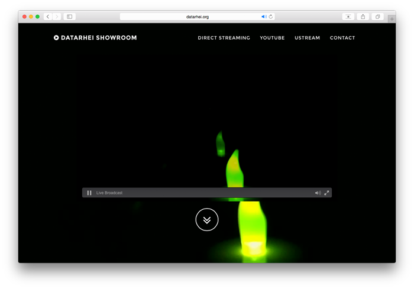

# Embed the Player

Für die Einbindung findest Du in der Oberfläche die erforderlichen Code-Beispiele, sobald Du auf den Link "Player öffnen" klickst. 

Damit die Dienste aber auch über Deinen Internet-Anschluss verfügbar sind, musst Du als Erstes Deinen Router entsprechend konfigurieren und den Port 8080 auf das Gerät weiterleiten, auf dem Du den ReStreamer betreibst. Bitte schaue dafür ggf. in das Handbuch Deines Routers und suche nach "Port-Weiterleitung".

Kopiere anschließend den iFrame-Code von der Playerseite, füge ihn in dem gewünschten Bereich auf Deiner Webseite ein (HTML-Kenntnisse sind minimal erforderlich) und veröffentliche die Änderung. Sofern die Port-Weiterleitung korrekt eingerichtet ist und der ReStreamer korrekt läuft sollte der clappr-Player zu laden und Dein Kamera-Stream abrufbar sein.

[](http://datarhei.org/showroom/)

**Hinweis:**     
Da die meisten Internet-Anbieter dynamische IP-Adressen zuweisen, sollte man sich ggf. bei einem DynDNS-Service (z.B. dnydns.org) anbmelden. Die meisten Router bieten dafür schon auf der Web-Oberfläche entsprechende Funktionen, welche eine seperate Installation nicht mehr erforderlich macht. Sobald Du Dir solch eine Domain (z.b. max-mustermann.dnydns.org) eingerichtet und diese aktiviert hast, kann Du in dem Code-Beispielen die Source wie folgt abändern:

```html
<iframe src="http://max-mustermann.dnydns.org:8080/player.html" name="restreamer-player" width="800" height="450" scrolling="no" frameborder="0" webkitallowfullscreen="true" mozallowfullscreen="true" allowfullscreen="true"></iframe>
````

```html

```

---

Want to talk to us? Write email open@datarhei.org, go to [Support](../support.html) or choose a nickname and join us on <a target= "_blank" href="https://webchat.freenode.net/?channels=datarhei">#datarhei webchat on freenode</a>.

If you're having a weird problem while developing, see [Known Issues](https://github.com/datarhei/small-restreamer-internal/issues/). 
