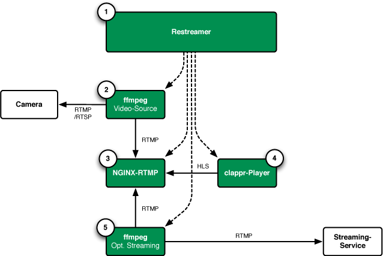

# Architecture

The Datarhei/Restreamer basically consists of four different applications:

* Frontend with Angular and Node.js for process management
* NGINX web server with the RTMP-Module
* FFmpeg as swiss army knife for video processing
* Clappr video player

---

---

### Processes:

1. The application provides the user interface / HTTP API and starts the NGINX web server using the supplied config  (/restreamer/config/nginx.conf)  
2. FFmpeg fetches the camera stream and forwards it to the local running NGINX RTMP servers rtmp://127.0.0.1:1935/live/live.stream and rtmp://127.0.0.1:1935/hls/live.stream.m3u8  
3. NGINX-RTMP delivers the camera stream to the address: http://...:8080/live/live.stream.m3u8
4. Clappr videoplayer calls the camera stream via HTTP (HLS)
5. Additonally, FFmpeg takes the local NGINX-RTMP video stream rtmp://127.0.0.1:1935/live/live.stream and pushes the source to 
the registered favourite address

---

Want to talk to us? Write an email to <a href="mailto:open@datarhei.org?subject=Datarhei/Restreamer">open@datarhei.org</a>, go to [Support](../support.html) or choose a nickname speak to us in IRC: <a href="irc://irc.freenode.net#piwik">irc.freenode.net/#datarhei</a> (<a target= "_blank" href="https://webchat.freenode.net/?channels=datarhei">webchat</a>). You could ask a question in our (<a target= "_blank" href="https://groups.google.com/forum/#!forum/datarhei">Forum</a>) on Google Groups, too. If you're having a problem while developing, see <a target= "_blank" href="https://github.com/datarhei/restreamer/issues">Known Issues</a>.  