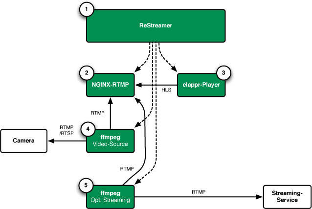

# Architecture

Der Datarhei/Restreamer besteht grundlegend aus vier verschiedenen Applikationen:

* Frontend basierend auf Angular und Node.js für das Prozessmanagement
* NGINX inkl. dem RTMP-Modul
* ffmpeg als universeller Video-Prozessor
* clappr als Video-Player

---

---

### Prozesse:

1. die Applikation stellt das User-Interface/HTTP-API bereit und startet den NGINX-Webserver mit der mitgelieferten Config (/restreamer/config/nginx.conf)
2. ffmpeg holt den Kamera-Stream und leitet ihn weiter an den lokalen NGINX-RTMP-Server auf rtmp://127.0.0.1:1935/live/live.stream und rtmp://127.0.0.1:1935/hls/live.stream.m3u8
3. ab jetzt stellt der NGINX-RTMP den Stream unter der Adressen http://...:8080/live/live.stream.m3u8 bereit
4. der clappr-Player ruft den Stream per HTTP (HLS) ab
5. zusätzlich wird, sofern konfiguriert, per ffmpeg den am lokalen NGINX-RTMP anliegenden Kamera-Stream von rtmp://127.0.0.1:1935/live/live.stream ab und leitet diesen zu der eingetragenen Adresse weiter

---

Want to talk to us? Write email open@datarhei.org, go to [Support](../support.html) or choose a nickname and join us on <a target= "_blank" href="https://webchat.freenode.net/?channels=datarhei">#datarhei webchat on freenode</a>.

If you're having a weird problem while developing, see [Known Issues](https://github.com/datarhei/small-restreamer-internal/issues/). 
