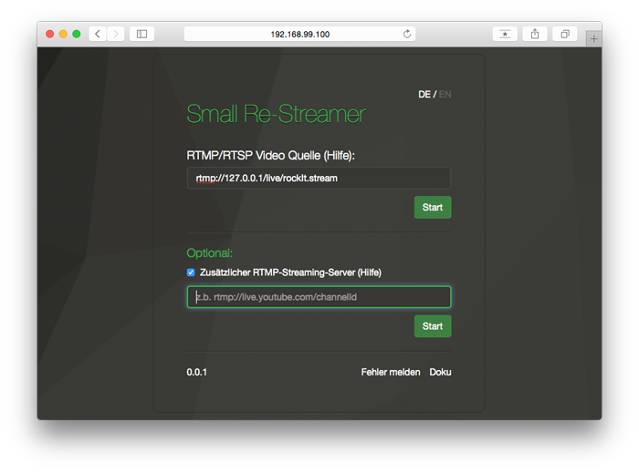

# Stream to external services
---
For the forwarding of your video stream to an external video service provider or other external services like YouTube, you can use the field "Additional RTMP streaming server". The check box is accessible once the connection is established to your camera.

**These are some examples of the most well-known services:**

Prerequisite is a registration or a channel with the providers , you will also receive the required address information . After logging in , you will find here the standard addresses that you need for streaming with Datarhei / Restreamer :

- Youtube-Live ([Help](https://support.google.com/youtube/topic/6136989?hl=de&ref_topic=2853712))     
  rtmp://a.rtmp.youtube.com/live2/[your_channel]
- UStream ([Help](https://support.ustream.tv/hc/en-us/articles/207851987-How-to-stream-to-Ustream-using-Wirecast-FMLE-TriCaster-or-any-RTMP-encoder))     
  e.g. rtmp://1.21452594.fme.ustream.tv/ustreamVideo/[user]/[your_channel]
- Livestream.com ([Help](http://original.livestream.com/userguide/index.php?title=Main_Page&title=Use_Flash_Media_Encoder_On2_Flix_live_or_Wirecast_with_Livestream))     
  rtmp://publish.livestream.com/mogulus/[your_channel]/username=[username]/password=[password]/isAutoLive=true

Next, you are adding the destination address in your Datarhei/Restreamer:

  

Once the process has been successfully established, the stream should also be seen at the external provider (it can sometimes take a couple of seconds - be patient ).

1. Add Adress
2. Start Proces

---

Want to talk to us? Write email open@datarhei.org, go to [Support](../support.html) or choose a nickname and join us on <a target= "_blank" href="https://webchat.freenode.net/?channels=datarhei">#datarhei webchat on freenode</a>.

If you're having a weird problem while developing, see [Known Issues](https://github.com/datarhei/small-restreamer-internal/issues/). 
