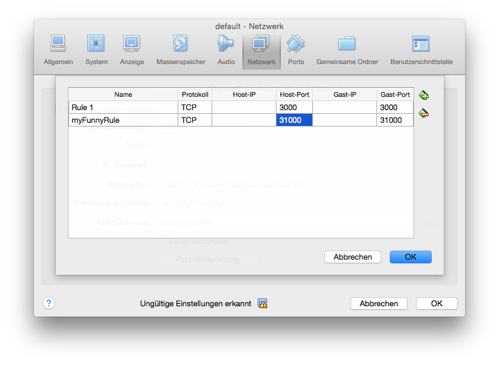

# Datarhei Hints ☺

* [Docker](#docker)
* [Kitematic/VirtualBox](#kitematic-virtualbox)

### Docker

We prefer starting the Docker image aldways e.g.:

```sh
docker run \
    -d \
    --name restreamer \
    -v /mnt/restreamer/db:/restreamer/db \
    --restart always \
    -p 8080:8080 \
        datarhei/restreamer:latest
```

#### Persistent data
If you want to save your configs export the small json database on your device-disc. 
Add: `-v /mnt/restreamer/db:/restreamer/db`

#### Restarting on failer
The Docker-Daemon is monitoring your container and will start it it again, if it runs into errors. Add:
`--restart always`

#### Starting on boot
Small Linux example:

```sh
description "datarhei/ReStreamer"
author "datarhei.org"
start on filesystem and started docker
stop on runlevel [!2345]
respawn
script
  /usr/bin/docker start -a restreamer
end script
```

1. Exec `vim /etc/init/restreamer.conf` and paste guiding code:
2. Save doc
3. Start container `--name restreamer`

### Kitematic / VirtualBox

1. start your ReStreamer with Kitematic
2. open the user-interface and copy the port
3. open VirtualBox and and by the running virtualmachnine named "default" on edit
    
4. select the tab "network" and click on the button "port-forwarding"
    
5. create new rule and paste the copyed port-number into "host-port" and "guest-port"
    
6. save this changes by closing alls the windows with "ok"
7. open the ReStreamer upon your browser by "http://127.0.0.1:copyed-port"

---

Want to talk to us? Write email open@datarhei.org, go to [Support](../support.html) or choose a nickname and join us on <a target= "_blank" href="https://webchat.freenode.net/?channels=datarhei">#datarhei webchat on freenode</a>.

If you're having a weird problem while developing, see [Known Issues](https://github.com/datarhei/restreamer/issues/). 
