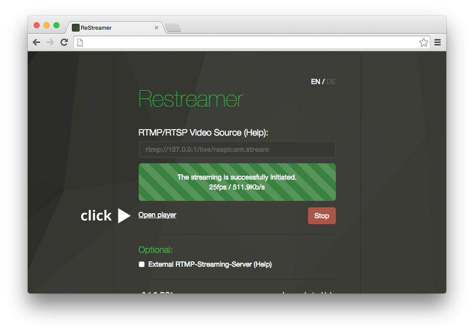
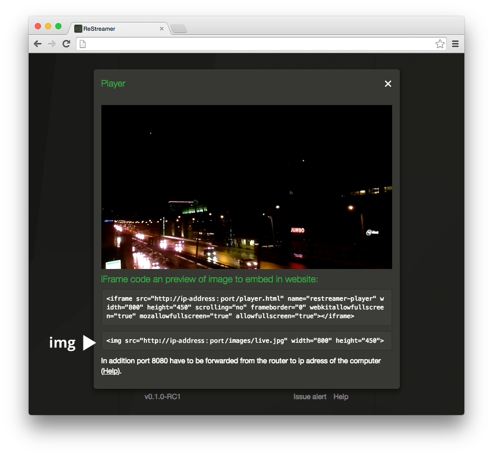

# Embed upon your Website

To embed the Player and/or the Snapshot follow the next steps:

1. Open the [Preview-Player](guides-embed-upon-your-website.html#open-the--preview-player)
2. Get the [Player-Code](guides-embed-upon-your-website.html#get-the-player-code)
3. Get the [Snapshot-Code](guides-embed-upon-your-website.html#get-the-snapshot-code)

## Open the Preview-Player

1. Open your Datarhei/Restreamer GUI via the local IP address of your device in the web browser of your choice  
2. Open the Datarhei/Restreamer player
   

---

## Get the Player-Code

1. The HTML snippet for the video iframe code will be generated under the video player. Add your own dynamic IP address and put it on your own website. 
   
1. Datarhei/Restreamer generates the html tag with your public internet IP address. You can add your own dynamic IP address like:   
   `scr="http://123.245.789.123:8008/player.html"`   
   with your DynDNS - for example if your DynDNS is "foobar.zapto.org" the Datarhei/Restreamer link has to be:    
   `http://foobar.zapto.org:8080`.   
   The complete html tag should be like this:   
   `<iframe src="http://foobar.zapto.org:8080/player.html" name="restreamer-player" width="800" height="450" scrolling="no" frameborder="0" webkitallowfullscreen="true" mozallowfullscreen="true" allowfullscreen="true"></iframe>`   
2.	Change the size via width and height. Be patient with the correct aspect ratio for a pretty video!

**Datarhei Hint ☺** ► Do not forget to forward the TCP Port  ([Keyword: Porforwarding](/restreamer/wiki/portforwarding_en.html)) to use the html code successfully on your website. How to do portforwarding should be explained in the manual of your router.  

---

## Get the Snapshot-Code

1. You will find the embedded html code under the video player. Add the html code to your dynamic IP address and put it on your website: 
   
2. Datarhei generates the html tag with your public internet IP address. You can add your own dynamic IP address like:   
   ``
3. The snapshot will be updated default every 60 seconds. You can change this value in the configuration file of Datarhei. [How to change Snapshotinterval](references-environment-vars.html#snapshot-refreash-interval.html)

---
Want to talk to us? Write an email to <a href="mailto:open@datarhei.org?subject=Datarhei/Restreamer">open@datarhei.org</a>, go to [Support](../support.html) or choose a nickname speak to us in IRC: <a href="irc://irc.freenode.net#datarhei">irc.freenode.net/#datarhei</a> (<a target= "_blank" href="https://webchat.freenode.net/?channels=datarhei">webchat</a>). You could ask a question in our (<a target= "_blank" href="https://groups.google.com/forum/#!forum/datarhei">Forum</a>) on Google Groups, too. If you're having a problem while developing, see <a target= "_blank" href="https://github.com/datarhei/restreamer/issues">Known Issues</a>.
