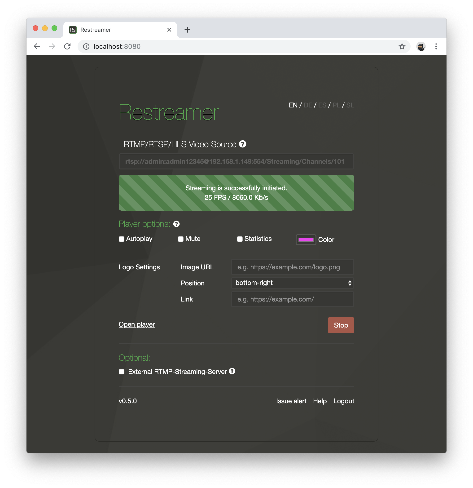

In order to embed the player and/or the snapshot image, open and log in into your Restreamer GUI via the local IP address
of your device in the web browser of your choice.

Don't forget to [forward the TCP Port](../wiki/portforwarding.html) to use the HTML code successfully on your website.
Please refer to the manual of you router to find out how to enable port forwarding.
{: .notice--info} 

Open the Restreamer player


## Player

The HTML snippet for the video iframe code is listed under the video player.


Restreamer tries to find out your public internet IP address and uses it automatically in the HTML code snippet.
{: .notice--success}

If you have a dynamic DNS provider (e.g. DynDNS), you can replace the IP in the URL for iframe with your dynamic DNS name (e.g. foobar.zapto.org).

You also have to adjust the port that you actually forward. In your router you can configure that the port 8080 should be forwarded to
port 32000 (or whatever port you defined in Docker) on your Restreamer device.

```html
<iframe src="http://123.245.789.123:8080/player.html" ...></iframe>

<iframe src="http://foobar.zapto.org.123:8080/player.html" ...></iframe>
```

You can also change the width and height of the video by adjusting the `width` and `height` parameters in the iframe HTML tag.

## Player Configuration

The player can be configured in different ways. You do this either in the Restreamer GUI by ticking the appropriate checkboxes
or by providing query parameter to the player URL.



### Autoplay

If want to enable autoplay, simply tick the box "Autoplay" in the Restreamer GUI or add `?autoplay=1` after `player.html` such that it looks like this:
```html
<iframe src="http://.../player.html?autoplay=1" ...></iframe>
```

You may have to tick "Mute" (or use `mute=1` in the query string) as well because some browsers will not respect the autoplay setting if the the player is
not muted.

### Mute

Load the player muted. Tick the box "Autoplay" in the Restreamer GUI or add `?mute=1` to the query string.

```html
<iframe src="http://.../player.html?mute=1" ...></iframe>
```

This is usefull in conjuction with autoplay enabled (or use `autoplay=1` in the query string) because some browser will
not respect the autoplay setting if the player is not muted.

### Statistics

Display statistics about the stream. This will add a little icon in the top right corner of the player that you have to click
to open the statistics. Tick the box "Statistics" in the Restreamer GUI or add `stats=1` to the query string:
```html
<iframe src="http://.../player.html?stats=1" ...></iframe>
```

### Color

Set the color of the user interface for the player. Select a color in the Restreamer GUI or add `color=[your color]` to the query string:
```html
<iframe src="http://.../player.html?color=fb1ff3" ...></iframe>
```

The color is a 3-digit or 6-digit string that encodes a RGB color as a hexadecimal number, what you usually use in [HTML and CSS](https://en.wikipedia.org/wiki/Web_colors).

### Logo

Add a logo overlay to the player. Enter the URL to the logo image you want to use and select the position of the logo in the player (any
of the four corners). If you want the logo to be clickable, also provide an URL of a landing page that will be openend when the logo is clicked.

This option will not encode the logo into the stream. It simply displays the logo as an overlay in the player.
{: .notice--info}

## Snapshot

The HTML snippet for the snapshot code is listed under the video player.


Restreamer tries to find out your public internet IP address and uses it automatically in the HTML code snippet.
{: .notice--success}

If you have a dynamic DNS provider (e.g. DynDNS), you can replace the IP in the URL for iframe with your dynamic DNS name (e.g. foobar.zapto.org).

You also have to adjust the port that you actually forward. In your router you can configure that the port 8080 should be forwarded to
port 32000 (or whatever port you defined in Docker) on your Restreamer device.

```html


```

You can also change the width and height of the image by adjusting the `width` and `height` parameters in the img HTML tag.

The snapshot will be updated every 60 seconds by default. You can change this value by adjusting the `RS_SNAPSHOT_INTERVAL` [environment variable](references-environment-vars.html).
{: .notice--info}