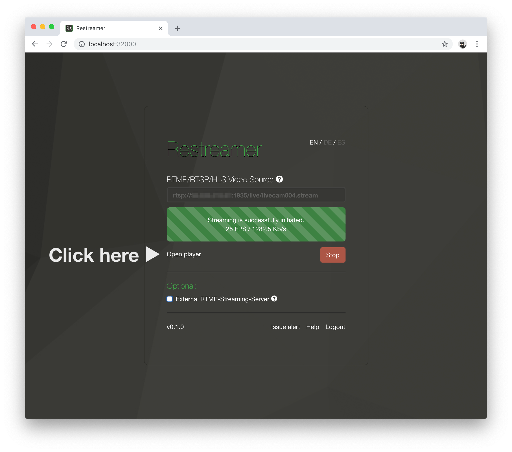
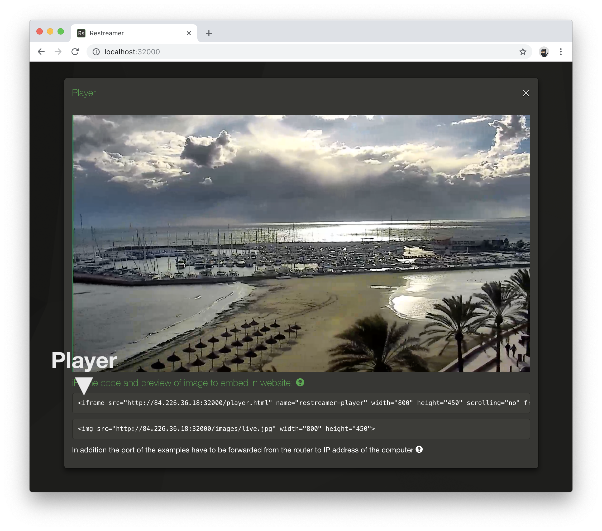
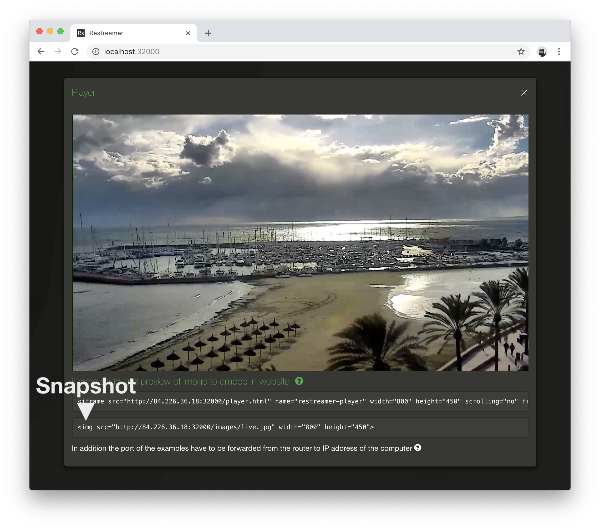

In order to embed the player and/or the snapshot image, open and log in into your Restreamer GUI via the local IP address
of your device in the web browser of your choice.

Don't forget to [forward the TCP Port](../wiki/portforwarding.html) to use the HTML code successfully on your website.
Please refer to the manual of you router to find out how to enable port forwarding.
{: .notice--info} 

Open the Restreamer player


## Player

The HTML snippet for the video iframe code is listed under the video player.


Restreamer tries to find out your public internet IP address and uses it automatically in the HTML code snippet.
{: .notice--success}

If you have a dynamic DNS provider (e.g. DynDNS), you can replace the IP in the URL for iframe with your dynamic DNS name (e.g. foobar.zapto.org).

You also have to adjust the port that you actually forward. In your router you can configure that the port 8080 should be forwarded to
port 32000 (or whatever port you defined in Docker) on your Restreamer device.

```html
<iframe src="http://123.245.789.123:8080/player.html" ...></iframe>

<iframe src="http://foobar.zapto.org.123:8080/player.html" ...></iframe>
```

You can also change the width and height of the video by adjusting the `width` and `height` parameters in the iframe HTML tag.

### Autoplay

If want to enable autoplay, simply add `?autoplay=1` after `player.html` such that it looks like this:
```html
<iframe src="http://.../player.html?autoplay=1" ...></iframe>
```

You may have to use `mute=1` as well because some browsers will not respect the autoplay setting if the the player is
not muted.

### Mute

Load the player muted. This is usefull in conjuction with `autoplay=1` because some browser will not respect the autoplay
setting if the player is not muted:
```html
<iframe src="http://.../player.html?mute=1" ...></iframe>
```

### Statistics

Display statistics about the stream. This will add a little icon in the top right corner of the player that you have to click
to open the statistics:
```html
<iframe src="http://.../player.html?stats=1" ...></iframe>
``` 

## Snapshot

The HTML snippet for the snapshot code is listed under the video player.


Restreamer tries to find out your public internet IP address and uses it automatically in the HTML code snippet.
{: .notice--success}

If you have a dynamic DNS provider (e.g. DynDNS), you can replace the IP in the URL for iframe with your dynamic DNS name (e.g. foobar.zapto.org).

You also have to adjust the port that you actually forward. In your router you can configure that the port 8080 should be forwarded to
port 32000 (or whatever port you defined in Docker) on your Restreamer device.

```html


```

You can also change the width and height of the image by adjusting the `width` and `height` parameters in the img HTML tag.

The snapshot will be updated every 60 seconds by default. You can change this value by adjusting the `RS_SNAPSHOT_INTERVAL` [environment variable](references-environment-vars.html).
{: .notice--info}