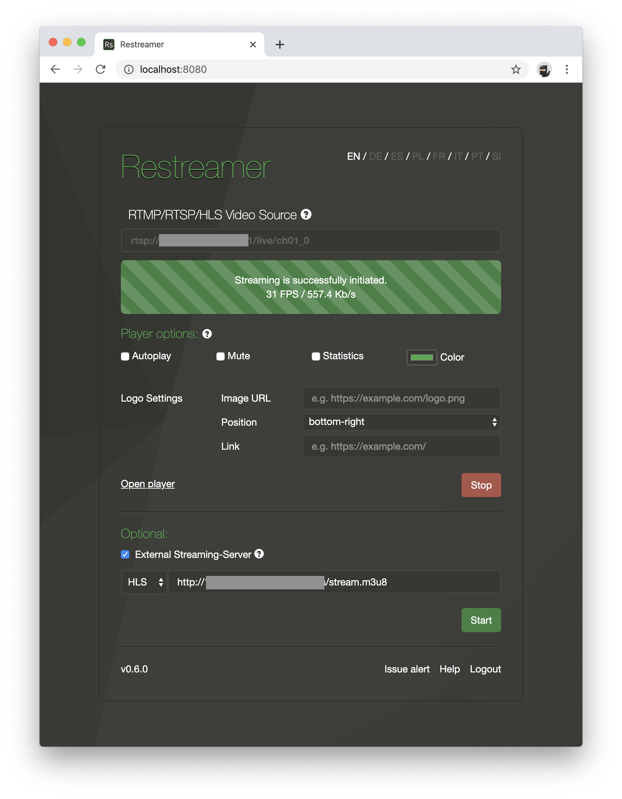
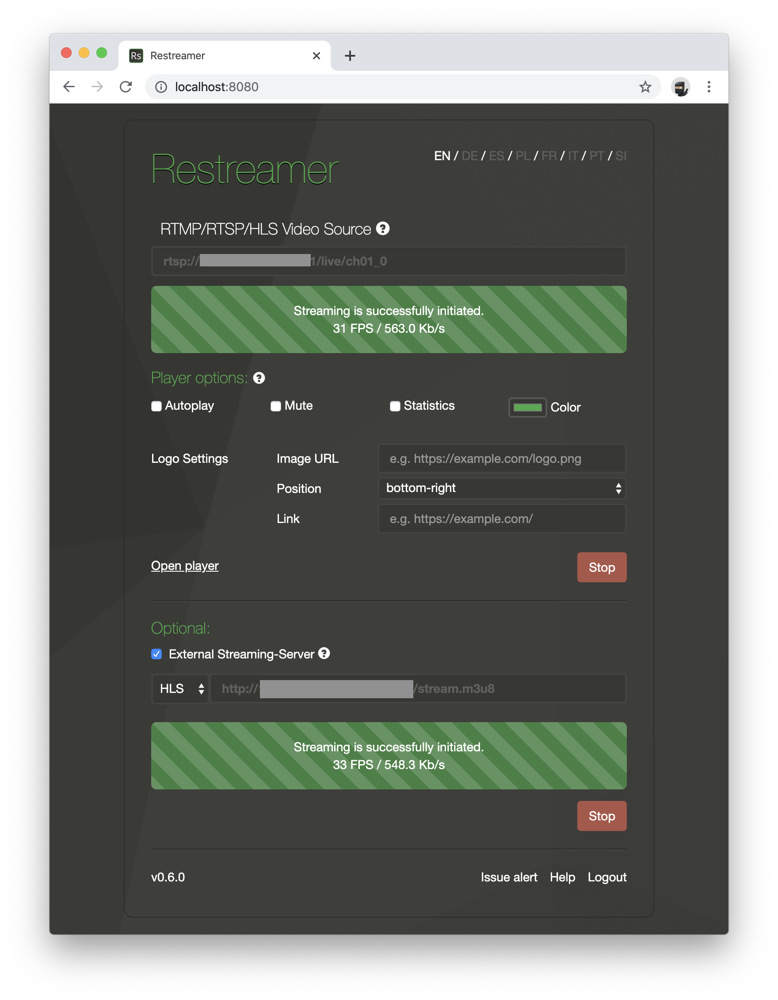

With Restreamer you can forward your stream to an external video streaming provider that supports HLS or a webserver.

Simply check "External Streaming-Server", select "HLS", and enter the HLS URL of the video service provider.

Press "Start". Once the process has been successfully initiated, the stream should be available from the video streaming provider
or from the webserver. Please be patient, this may take a couple of seconds.

If you set up your own HTTP webserver in order to push a HLS stream to it, please make sure that it supports GET, POST, and DELETE
for the directory you want to push the stream to. Also it is recommended that you require a username and password for POST and DELETE such
that only you can upload or delete files from the server.

## HLS Video Streaming Provider

This is a list of known video streaming providers that support HLS:

- [livespotting.com](https://livespotting.com)
