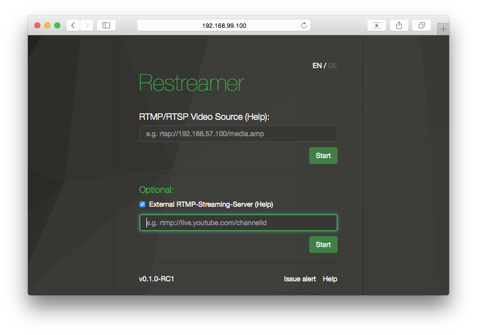

###### [User Guides](../docs/guides-index.html) > External RTMP streaming

# External RTMP streaming server
---
To forward your videostream to an external video service provider or other external services like YouTube, you can use the field "Additional RTMP streaming server". The check box is accessible once the connection to your camera is established.  

**These are some examples of the most well-known services:**  

Prerequisite is a registration or a channel with the providers, you will also receive the required address information. After logging in, you will find the standard addresses here that you need for streaming with Datarhei/Restreamer:  

- YouTube-Live <a target= "_blank" href="https://support.google.com/youtube/topic/6136989?hl=de&ref_topic=2853712/">(Help)</a>     
  rtmp://a.rtmp.youtube.com/live2/[your_channe/IDl]  
- Ustream <a target= "_blank" href="https://support.ustream.tv/hc/en-us/articles/207851987-How-to-stream-to-Ustream-using-Wirecast-FMLE-TriCaster-or-any-RTMP-encoder">(Help)</a>     
  e.g. rtmp://1.21452594.fme.ustream.tv/ustreamVideo/[user]/[your_channel/ID]  
- Livestream.com <a target= "_blank" href="http://original.livestream.com/userguide/index.php?title=Main_Page&title=Use_Flash_Media_Encoder_On2_Flix_live_or_Wirecast_with_Livestream">(Help)</a>     
  rtmp://publish.livestream.com/mogulus/[your_channel]/username=[username]/password=[password]/isAutoLive=true 
- Twitch.tv <a target= "_blank" href="http://www.twitch.tv/dashboard">(Help)</a> rtmp://live.twitch.tv/app/[your_channel/ID] - **A more detailed guide for Twitch.tv is documented in our [Wiki](../wiki/livestreaming-twitch.html)**

Next, add the destination address in your Datarhei/Restreamer:  

Last step: Start process

Once the process has been successfully established, the stream should also be seen at the external video provider (e.g. YouTube-Live). It can sometimes take a couple of seconds - be patient.

---