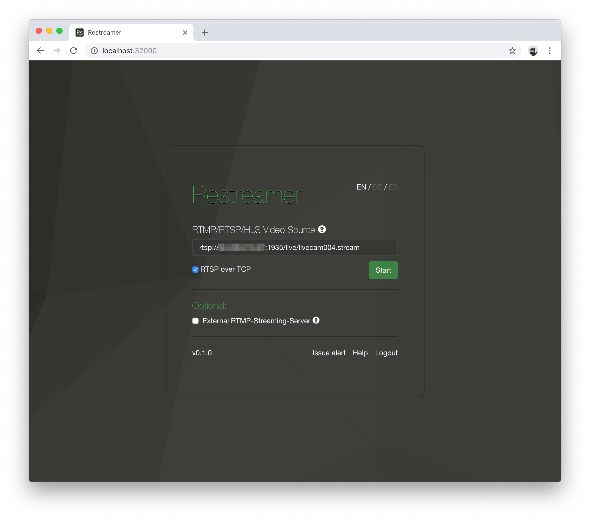
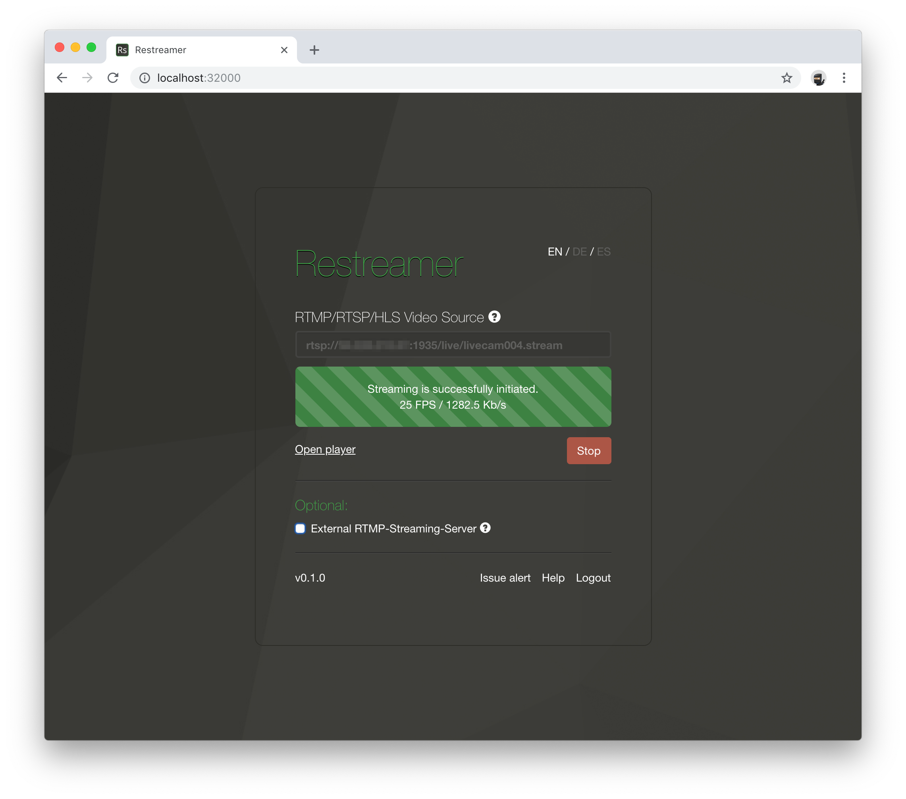

For the integration of an H.264 enabled network camera you need the address, at which you can retrieve the livestream from the camera.
Take a look at your camera manual and look for RTSP/RTP.  

For this purpose, please read the manual of your camera and search for "RTSP". Alternatively you can find already many templates on the
[Soleratec website](https://www.soleratec.com/support/rtsp/).

## Examples

| Brand | RTSP URL |
|-------|----------|
| AXIS  | `rtsp://ip-address:554/axis-media/media.amp` |
| Samsung | `rtsp://ip-address:554/profile2/media.smp` |

You can find the IP address of your camera, if necessary, in the DHCP table of your router. You can also use a LAN scanner like [Angry IP Scanner](https://angryip.org/) which displays all the devices on your network if you are unsure what the correct IP address is.  

## Start Streaming

Put the RTSP URL of your camera in the "RTMP/RTSP/HLS Video Source" field in the Restreamer user interface:  

Then press on the "Start" button.

Once the process has been successfully initiated, you can open the Restramer player and, if necessary, forward the stream to an [external provider](guides-external-rtmp.html) of the player.    
