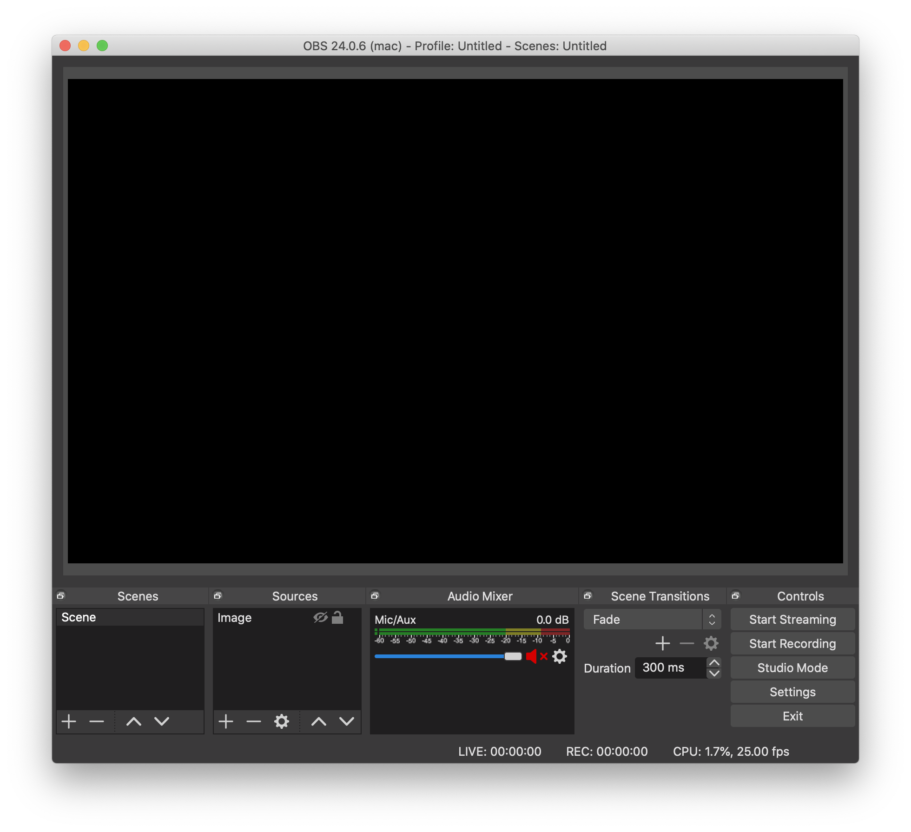
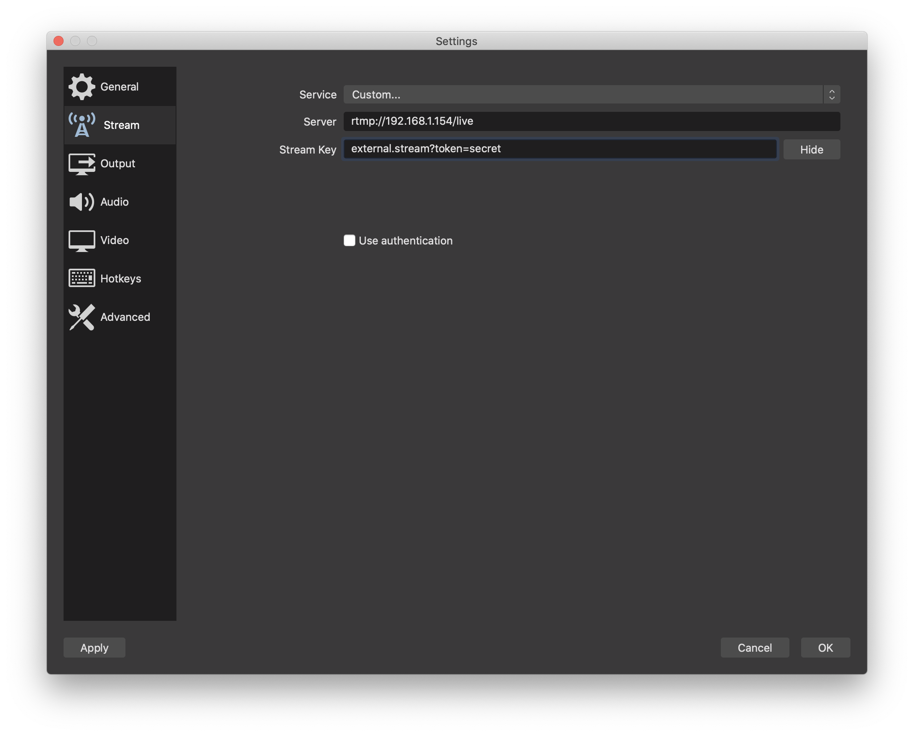
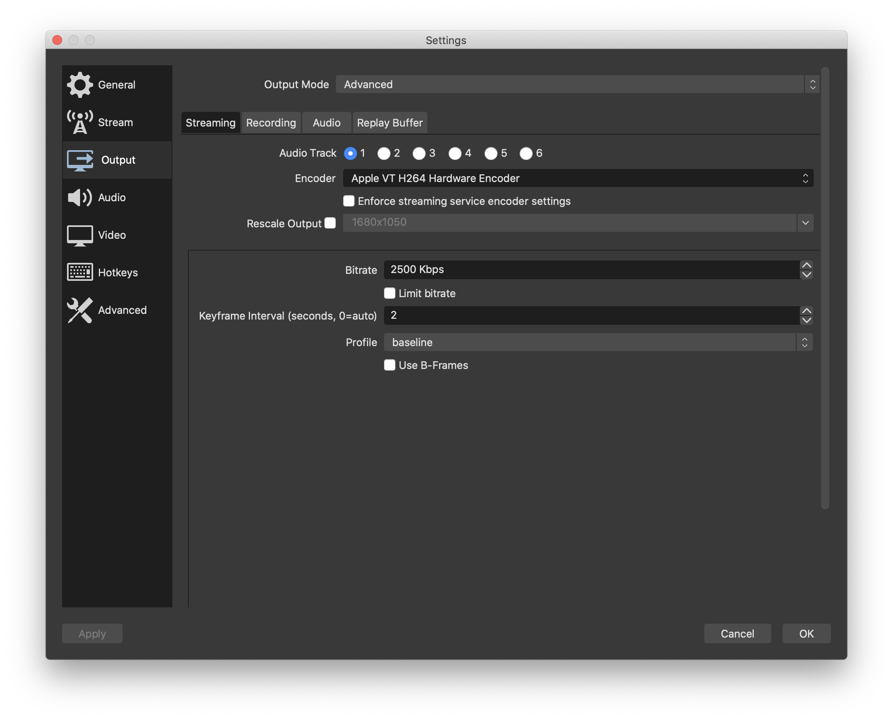
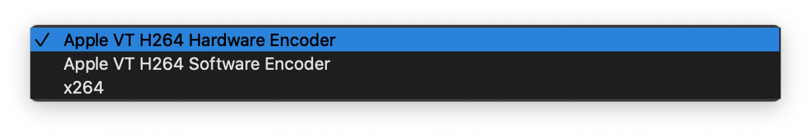
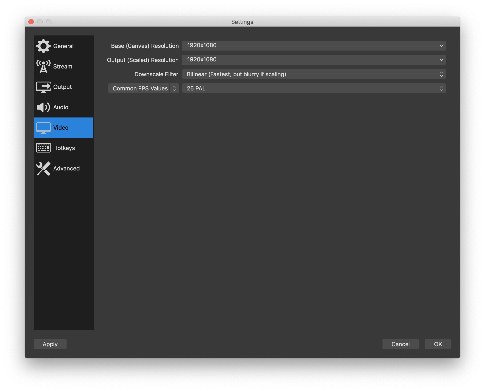
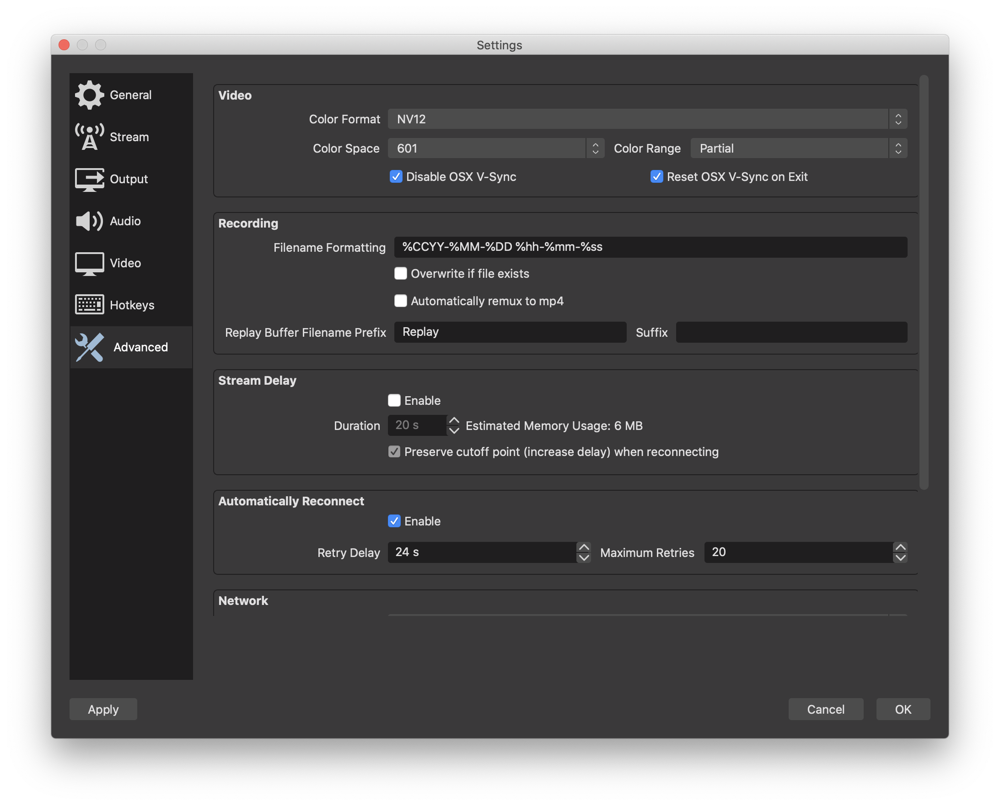
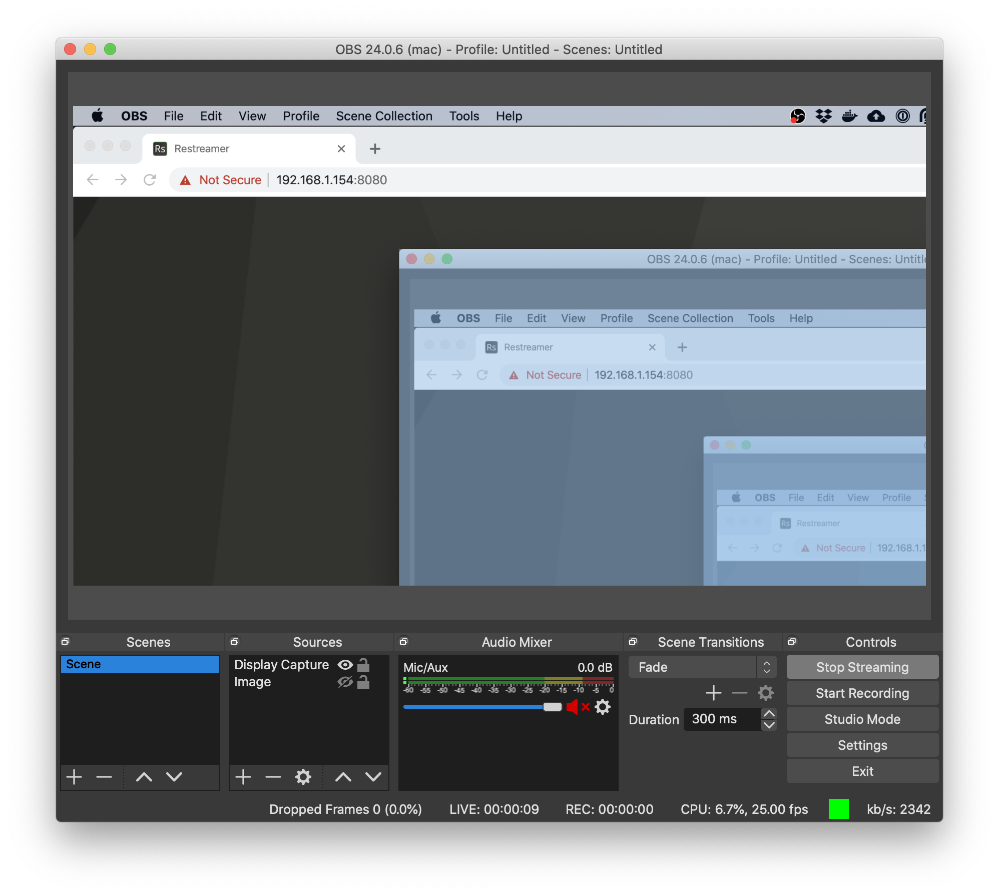
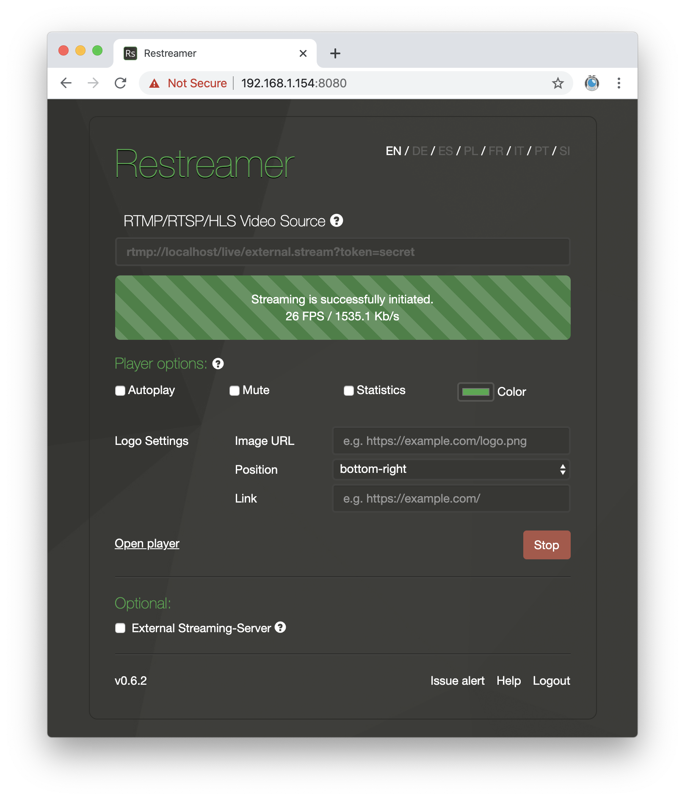

You can use [OBS](https://obsproject.com/) to stream e.g. your desktop or a connected camera to Restreamer. This guide will show
the settings for OBS in order to work seamlessly with Restreamer.

First, you need to setup Restreamer such that it can [ingest RTMP](guides-ingest-rtmp.html) streams. For this guide, assume that
you use `secret` as value for the token and that Restreamer is using the default RTMP port (1935) for incoming RTMP streams.

In real-world settings you have to choose a non-guessable string for the token. Consider it as the password for the streaming
server.

After starting OBS, click on "Settings" and select the tab "Stream".

For "Service" select "Custom...". In the field "Server" enter the RTMP `tcUrl`, which is `rtmp://xxx.xxx.xxx.xxx/live` where you
replace `xxx.xxx.xxx.xxx` with the IP or hostname of your Restreamer. The "Stream Key" is the file name. Here, we use
`external.stream?token=secret`. Don't tick the box "Use Authentication".

Switch to the "Output" tab and select the output mode "Advanced". For the encoder choose one that encodes to [H264](../wiki/h264.html).
On different OSes and hardware you have different options. If possible, use something that gives you hardware acceleration. On an Apple
computer you most likely have the hardware encoder via the videotoolbox available (Apple VT H264 Hardware Encoder). If you have a nVidia
graphics card, you'll most likely have "nvenc" available. In any case, the "x264" software encoder will be always available.

Choose an appropriate bitrate. The higher the bitrate, the more bandwidth you need. Usually around 2500 to 3000 Kbps is a good value
for streaming in [FullHD (1920x1080)](../wiki/video-resolution.html). The bitrate is meant as an average, this means it can happen
that for a short moment the bitrate is higher than the selected value. If you want to avoid this, tick the box "Limit bitrate".

The "Keyframe Interval" is the number of seconds between two [key frames](../wiki/iframe.html). A value of 2 is a good compromise
between compression and latency.

The "Profile" gives some constraints to the encoder and decoder. "baseline" is the simplest profile with the least features for
encoding the stream. Also it is less complex and the most compatible one for decoders/players. However, "main" and "high" will also
work, especially if you have higher resolutions and frame rates.

Untick the box "Use B-Frames". They are used to achieve a higher compression (lower bitrate) but are more complex and require
more buffering in the decoder/player which in turn increases the latency. This is usually not wanted for a live stream.

In the "Video" tab you can adjust what part of the input and in which resolution you're going to stream. "Output Resolution" is the
resolution the stream will have. The FPS (or frame rate) is the number of frames per second in the stream. A value of 25 gives a
smooth experience. Lower values may be suitable where smooth movements are not required. The more frames per second, the higher the
bitrate will be. If the constraints for the bitrate are too low, then the video quality will be sacrificed.

Finally, switch to the "Advanced" tab. In the "Video" section, select the "NV12" color format.

Now you're done with the settings and click on "OK" in the lower right corner. You'll get back to the main OBS window where you select
your stream source.

Click on "Start Streaming" in order to send the stream to Restreamer.

Switch to the Restreamer UI and enter the URL `rtmp://localhost/live/external.stream?token=secret` in the video source
field. Keep in mind to put here the same file name and query parameter that you put in the OBS "Stream Key" setting in the "Stream" tab.
Select "copy" as video codec and press "Start". 

Now you can embed the player in a websizte or forward it to an [external video streaming provider](guides-external-rtmp.html) like
[YouTube](giudes-youtube.html), [Twitch](guides-twitch.html), Facebook, or others.

