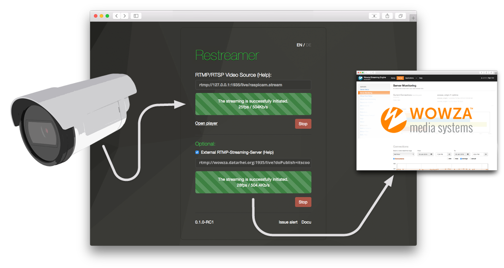

###### [Learn more](../docs/guides-index.html) > Wowza

## Push to the Wowza-Streaming-Engine

One of the possible applications is to stream a local camera to a streaming service based on the <a target= "_blank" href="https://www.wowza.com/products/streaming-engine/">Wowza-Streaming-Engine</a> without sharing the player on a website. 

This can be the scalable <a target= "_blank" href="https://www.wowza.com/products/streaming-cloud/">Wowza Streaming Cloud</a> or a smart company like <a target= "_blank" href="http://www.video-stream-hosting.com/">Video-Stream-Hosting</a> from Germany.

In both cases you have to

1. connect Restreamer with your Camera
2. put the address of your streaming server into the "Additional RTMP streaming server" field   
   `rtmp://[server-address]:1935/[application-name]/live.stream`   
   or if you are using [ModuleSecureURLParams](https://www.wowza.com/forums/content.php?233-How-to-secure-publishing-from-an-RTMP-encoder-that-does-not-support-authentication), take   
   `rtmp://[server-address]/[application-name]/?doPublish=[secure-url-param]/livestream`

That's it!

---