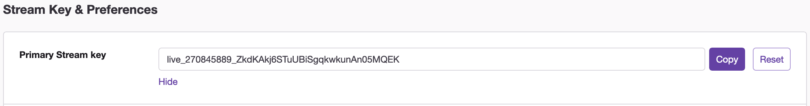
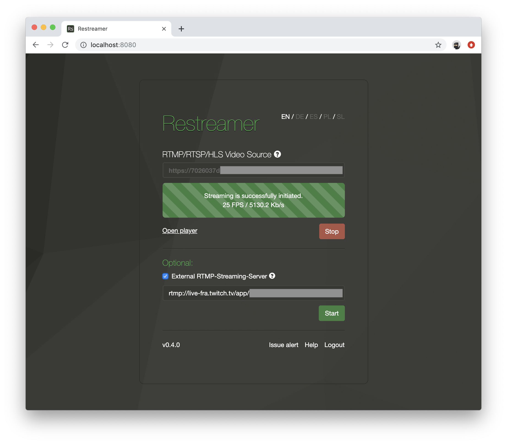
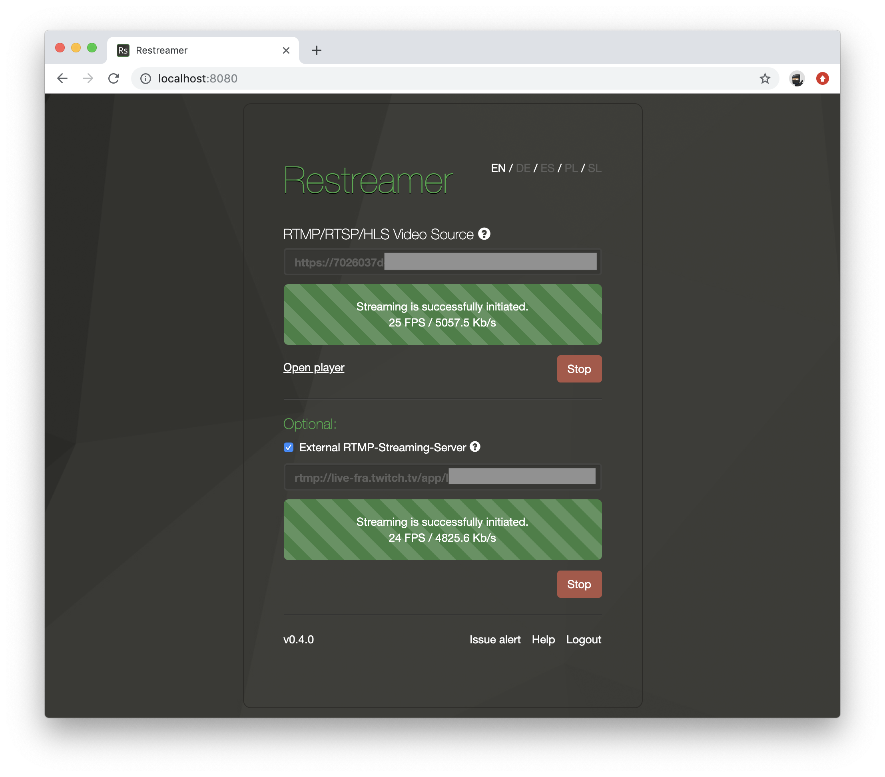
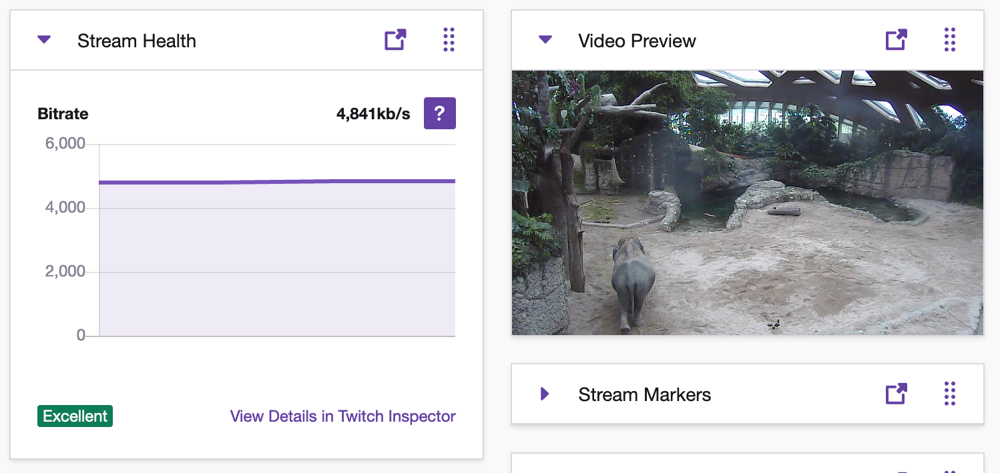

## Setup Restreamer

In order to be able to push your stream to Twitch, the stream must contain an audio track that has to be encoded in `AAC`.
If this is not already the case you can force the encoding of the audio stream by selecting `AAC` as the codec in the stream options
and use the `encode` preset. For versions prior 0.4.0, set the environment variable `RS_AUDIO` to `aac`.

If your stream doesn't contain an audio track or you do not want to push the audio of your stream to Twitch, select `AAC` as the codec
in the stream options and use the `silence` preset. This will replace the audio track with silence, encoded in `AAC`.  For versions prior
0.4.0, set the environment variable `RS_AUDIO` to `silence`.

Check out the [encoding options](guides-encoding.html) to learn more about the stream options.

Read more about the [streaming guidelines](https://stream.twitch.tv/encoding/) for Twitch.

## Setup Twitch

Log in into your Twitch account and navigate to the settings in your creator dashboard.

On the top you'll find the "Primary Stream key". Click on "Show" to display the key or click on "Copy" to copy the key
to your clipboard.

Append this key to the RTMP-URL of a Twitch ingestion server near your location. Check out the [Twitch Ingests](https://stream.twitch.tv/ingests/)
for an appropriate ingestion server.

Your RTMP-URL that you need for Restreamer will look like `rtmp://live-fra.twitch.tv/app/{stream_key}` where you have to replace `{stream_key}` with
the key from above.

## Push to Twitch

To push your video stream to Twitch, you have to check the field "External Streaming-Server", select "RTMP", and enter the RTMP-URL from above into the field ...

... and press "Start":

Once the process has been successfully initiated, the stream should also be seen in your Twitch live dashboard.
Please be patient, this may take a few of seconds.

## Stream Health

The current stream health is shown in the live dashboard in the "Stream Health widget". To get more details about the stream health, use the link
to [Twitch Inspector](https://inspector.twitch.tv/).

On the managmenet interface of your [IP camera](guides-ipcam-rtsp.html), you often have the possibility (depending on the manufacturer) to adjust
the bitrate and other aspects of the output stream.
