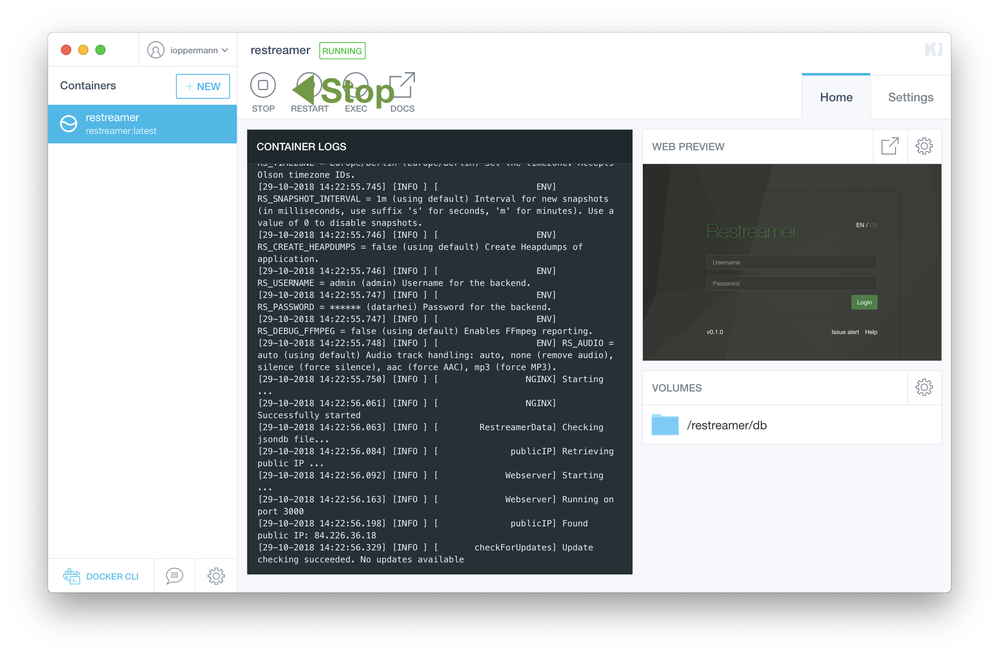
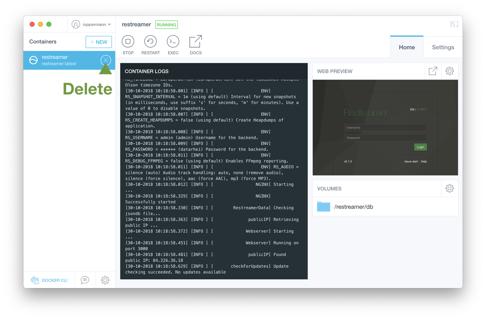
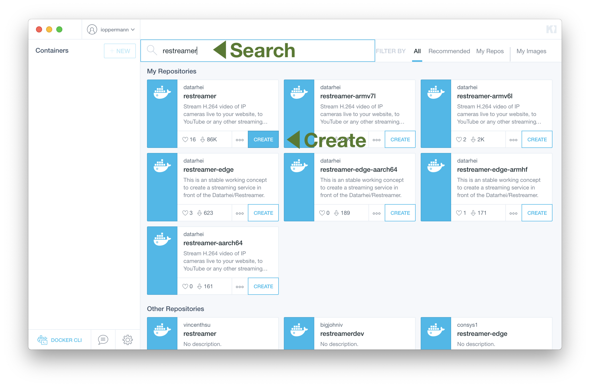
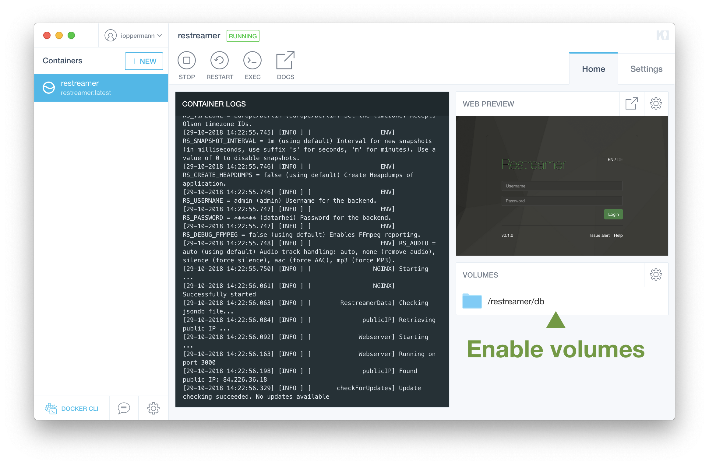

To update the Restreamer without losing the data of the input fields it is required to start the Docker image with `-v /path/to/local:/restreamer/db` ([more info](installation-linux-64.html#description-of-the-command)) or a activated volume in Kitematic ([more info](installation-osx-windows.html#important-customizations))!

* [Windows / macOS](#windows-macos)
* [Linux](#linux)

## Windows / macOS

1. Open Kitematic and click in the running Restreamer on "STOP":
   

2. Delete the old image:
   

3. Start the image: 
  

4. Enable the volume:
  

5. Insert your enviroment variables again ([more here](references-environment-vars.html))

Done! 

## Linux

1. Stop and remove the running Restreamer:
  
  ```sh
  docker stop restreamer && docker rm restreamer
  ```

2. Download the new image. Please do not forget to add the right arm-tag if used.
  
  ```sh
  # for x86_64 / amd64 architecture
  docker pull datarhei/restreamer:latest

  # for armv6 end armv7 architecture
  docker pull datarhei/restreamer-armhf:latest
  ```

3. Start the Restreamer again (please remember to modify if you have your own configuration):
   
  ```sh
  docker run -d --restart always \
    --name restreamer \
    -e "RS_USERNAME=..." -e "RS_PASSWORD=..." \
    -p 8080:8080 \
    -v /mnt/restreamer/db:/restreamer/db \
    datarhei/restreamer:latest
  ```

Done!
