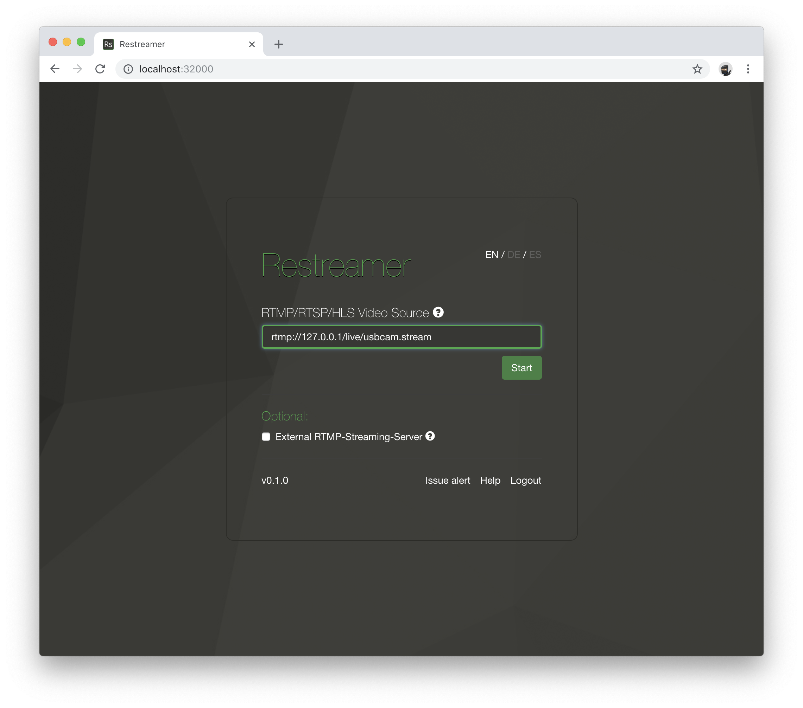

On older ARMv6l / ARMv7l (e.g. Raspberry Pi 1 or 2), USB cameras work but only with a very low framerate. It will work with a higher
framerate on more powerfull systems. Because the video stream from an USB camera is usually not encoded in H.264, which is a
requirement for Restreamer, it needs to be encoded. This encoding requires significant CPU resources.

Your USB camera needs to be v4l (Video4Linux) compliant in order to work with Restreamer. Because of this, USB cameras currently work only with
Restreamer on Linux Docker hosts.
{: .notice--info}

## Configure Restreamer

Connect the USB camera. For Restreamer to be able to access the USB camera, you have to stop the Restreamer if it is currently running:

```sh
docker stop restreamer
docker rm restreamer
```

Restart the Restreamer with the USB camera with the environment variable `RS_MODE=USBCAM` and add the video device from the host to the container as `/dev/video`:

```sh 
docker run -d --restart always \
    --name restreamer \
    -e "RS_USERNAME=..." -e "RS_PASSWORD=..." -e "RS_MODE=USBCAM" \
    -p 8080:8080 \
    -v /mnt/restreamer/db:/restreamer/db \
    --device /dev/video0:/dev/video \
    datarhei/restreamer:latest
```

If you are running this on an ARM device, please use the `datarhei/restreamer-armv7l:latest` Docker image.
{: .notice--info}

Please read the [Video Support](#video-support) section in order to find out what USB camera devices are available.

In order to stream what your USB camera is recording, you have to put `rtmp://127.0.0.1/live/usbcam.stream` into
the "RTMP/RTSP/HLS Video Source" field and press "Start".



## Environment Variables

These environment variables enable you to control the encoding of the video stream from your USB camera.

| Name | Default | Description |
|------|---------|-------------|
| `RS_USBCAM_VIDEODEVICE` | `/dev/video` | The path to container video device that you also pass in the command line for Docker. |
| `RS_USBCAM_FPS` | `25` | Set the framerate. The effective framerate may get changed based on the [capabilities of your USB camera](#video-support). |
| `RS_USBCAM_GOP` | `50` | Set the GOP size. Usually the framerate multiplied by 2 is a good value. |
| `RS_USBCAM_BITRATE` | `5000000` | Bitrate of the video stream in bit/s, e.g. `5000000` is 5Mbit/s. |
| `RS_USBCAM_H264PRESET` | `ultrafast` | Set a preset for H.264 encoding. `ultrafast` is the fasted encoding that requires the least CPU. Read more about the [available H.264 presets](http://dev.beandog.org/x264_preset_reference.html). |
| `RS_USBCAM_WIDTH` | `1280` | Video stream width in pixels. You have to set this values according to the [capabilities of your USB camera](#video-support). |
| `RS_USBCAM_HEIGHT` | `720` | Video stream height in pixels. You have to set this values according to the [capabilities of your USB camera](#video-support). |
| `RS_USBCAM_AUDIO` | `false` | Set this to `true` to enable audio from you USB camera. Please read more below in the [Audio Support](#audio-support) section. |
| `RS_USBCAM_AUDIODEVICE` | `0` | The audio device number according to the ALSA utilities. Please read more below in the [Audio Support](#audio-support) section. |

Change the defaults of these environment variable with care and make sure that you know what you are doing.

## Video Support

For a list of available video devices on your host system, call (you need to have the `v4l-utils` installed):

```sh
v4l2-ctl --list-devices
```

The output may look like this:

```
Webcam C170: Webcam C170 (usb-3f980000.usb-1.1.2):
        /dev/video1

Microsoft® LifeCam HD-3000: Mi (usb-3f980000.usb-1.3):
        /dev/video0
```

If you want to stream the "LifeCam HD-3000", you have to add `/dev/video0` as `/dev/video` to the Docker container: `--device /dev/video0:/dev/video`.
If you want to stream the "Webcam C170", you have to add `/dev/video1` as `/dev/video` to the Docker container: `--device /dev/video1:/dev/video`.

To see a list of all available formats that you may pass as value for the environment variables `RS_USBCAM_FPS`, `RS_USBCAM_WIDTH`, and `RS_USBCAM_HEIGHT`, call:

```sh
v4l2-ctl -d /dev/video0 --list-formats-ext
```

This will output something like this (shortened):

```
ioctl: VIDIOC_ENUM_FMT
        Index       : 0
        Type        : Video Capture
        Pixel Format: 'YUYV'
        Name        : YUYV 4:2:2
                Size: Discrete 640x480
                        Interval: Discrete 0.033s (30.000 fps)
                        Interval: Discrete 0.050s (20.000 fps)
                        Interval: Discrete 0.067s (15.000 fps)
                        Interval: Discrete 0.100s (10.000 fps)
                        Interval: Discrete 0.133s (7.500 fps)
                Size: Discrete 1280x720
                        Interval: Discrete 0.100s (10.000 fps)
                        Interval: Discrete 0.133s (7.500 fps)
                Size: Discrete 960x544
                        Interval: Discrete 0.067s (15.000 fps)
                        Interval: Discrete 0.100s (10.000 fps)
                        Interval: Discrete 0.133s (7.500 fps)
                Size: Discrete 800x448
                        Interval: Discrete 0.050s (20.000 fps)
                        Interval: Discrete 0.067s (15.000 fps)
                        Interval: Discrete 0.100s (10.000 fps)
                        Interval: Discrete 0.133s (7.500 fps)
...
(output truncated)
```

There you see, that you can stream e.g. in a resolution of 1280x720 with 10 frames per second or in a resolution of 640x480 with 30 frames per seconds,
just to name a few examples. Use these values for the respective environment variables.

## Audio Support

Audio is currently only supported on Linux Docker hosts that have the `/dev/snd` device available. In order to make the sound device
available inside of the docker container, you have to add it to the container and enable audio with `RS_USBCAM_AUDIO=true`:

```sh
docker run -d --restart always \
    --name restreamer \
    -e "RS_USERNAME=..." -e "RS_PASSWORD=..." \
    -e "RS_MODE=USBCAM" -e "RS_USBCAM_AUDIO=true" \
    -p 8080:8080 \
    -v /mnt/restreamer/db:/restreamer/db \
    --device /dev/video0:/dev/video \
    --device /dev/snd \
    datarhei/restreamer:latest
```

The sound device is accessed with the ALSA drivers. Depending what system you have, there may be several audio devices available and you have to
pass the `RS_USBCAM_AUDIODEVICE` with the correct value for your USB camera. To find the correct value, call (you need to have the `alsa-utils` installed):

```sh
arecord --list-devices
```

The output could be similar to this:

```
**** List of CAPTURE Hardware Devices ****
card 1: HD3000 [Microsoft® LifeCam HD-3000], device 0: USB Audio [USB Audio]
  Subdevices: 1/1
  Subdevice #0: subdevice #0
card 2: C170 [Webcam C170], device 0: USB Audio [USB Audio]
  Subdevices: 1/1
  Subdevice #0: subdevice #0
```

The value for `RS_USBCAM_AUDIODEVICE` is the number after `card`. In this example it is `1` for the audio from the LifeCam. It is also possible that
there are several devices with the same `card` number. Then you also have to specify the `device` number in the value, separated with a `,` after
the card number, e.g. `1,0`.

```sh
docker run -d --restart always \
    --name restreamer \
    -e "RS_USERNAME=..." -e "RS_PASSWORD=..." \
    -e "RS_MODE=USBCAM" -e "RS_USBCAM_AUDIO=true" -e "RS_USBCAM_AUDIODEVICE=1,0" \
    -p 8080:8080 \
    -v /mnt/restreamer/db:/restreamer/db \
    --device /dev/video0:/dev/video \
    --device /dev/snd \
    datarhei/restreamer:latest
```

