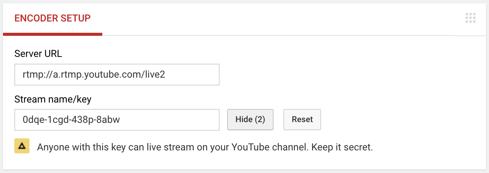
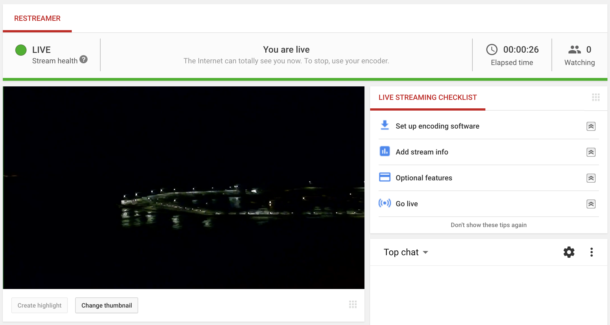
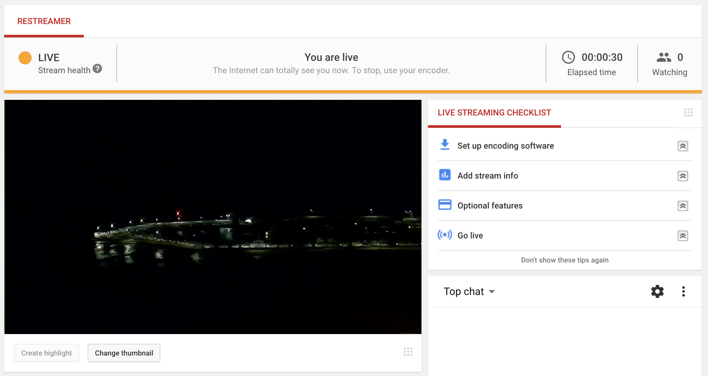
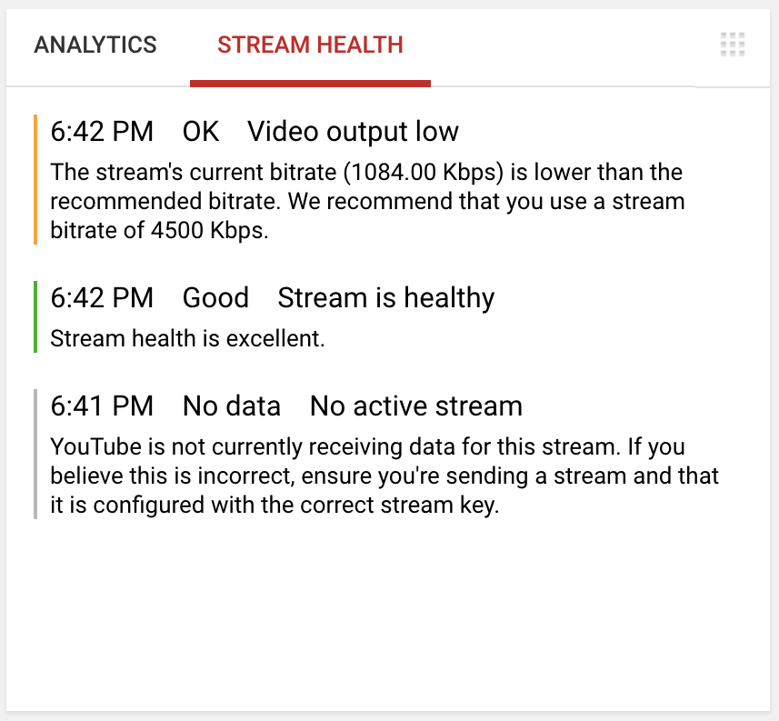

## Setup Restreamer

In order to be able to push your stream to YouTube, the stream must contain an audio track and it has to be encoded in `AAC` (`MP3` is
also possible but not recommended anymore).

If this is not already the case you can force the encoding of the audio stream by selecting `AAC` as the codec in the stream options
and use the `encode` preset. For versions prior 0.4.0, set the environment variable `RS_AUDIO` to `aac`.

If your stream doesn't contain an audio track or you do not want to push the audio of your stream to Twitch, select `AAC` as the codec
in the stream options and use the `silence` preset. This will replace the audio track with silence, encoded in `AAC`.  For versions prior
0.4.0, set the environment variable `RS_AUDIO` to `silence`.

Check out the [encoding options](guides-encoding.html) to learn more about the stream options.

Read more about the [stream requirements](https://support.google.com/youtube/answer/2853702).

## Setup YouTube

- Log in into your YouTube account
- Make sure that your YouTube channel is enabled for live streaming. [Read more](https://support.google.com/youtube/answer/2474026).
- Go to your [live dashboard](https://www.youtube.com/live_dashboard)

Scroll down and you'll find the YouTube RTMP-URL and your personal unique streaming ID after clicking on "reveal".

Your RTMP-URL that you need for Restreamer will look like `rtmp://a.rtmp.youtube.com/live2/0dqe-1cgd-438p-8abw`.

## Push to YouTube

To push your video stream to YouTube, you have to check the field "External RStreaming-Server", select "RTMP", and enter the RTMP-URL from above into the field ...

... and press "Start":

Once the process has been successfully initiated, the stream should also be seen at YouTube-Live.
Please be patient, this may take a few of seconds.

## Stream Health

Depending on the bitrate of your stream, YouTube may complain a bit (changing the color from green to orange), but this is OK.

 

On the managmenet interface of your [IP camera](guides-ipcam-rtsp.html), you often have the possibility (depending on the manufacturer) to adjust
the bitrate of the output stream. Please read more about the [stream requirements](https://support.google.com/youtube/answer/2853702).
