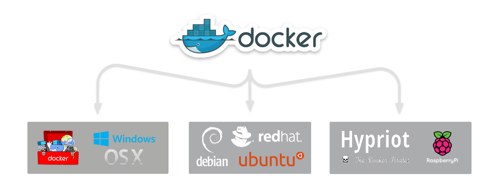

    

        <h1>Live video streaming on your website without  streaming providers</h1>
        
        
datarhei/ReStreamer allows smart free video streaming in real time. Stream H.264 video of IP cameras live to your website. Pump your live video to YouTube, Ustream, Twitch, Livestream.com or any other streaming-solutions e.g. Wowza-Streaming-Engine. Our Docker-Image is easy to install and runs on Linux, MacOS and Windows. datarhei/ReStreamer can be perfectly combined with single-board computers like Raspberry Pi and Odroid.

        
It is free (licensed under Apache 2.0) and you can use it for any purpose, personal or commercial.

        

            <a class="btn btn-success" href="docs/">Learn more</a>                    
            <a class="btn btn-success" href="docs/docker-setup.html">Docker quick start</a>
        

        

        <h3>Multiplattform support through Docker</h3>
        
        
Tested on: OSX 10.10/10.11, Raspberry Pi 1/2, Odroid U3

        

            <a class="btn btn-success" href="docs/docker-setup.html#osx-windows">OSX/Windows Setup</a>                    
            <a class="btn btn-success" href="docs/docker-setup.html#linux">Linux AMD64 Setup</a>
            <a class="btn btn-success" href="docs/docker-setup.html#armv6l">Linux ARMv6/v7 Setup</a>
        

        

        <h3>Powered by...</h3>
        
        

    
                          

