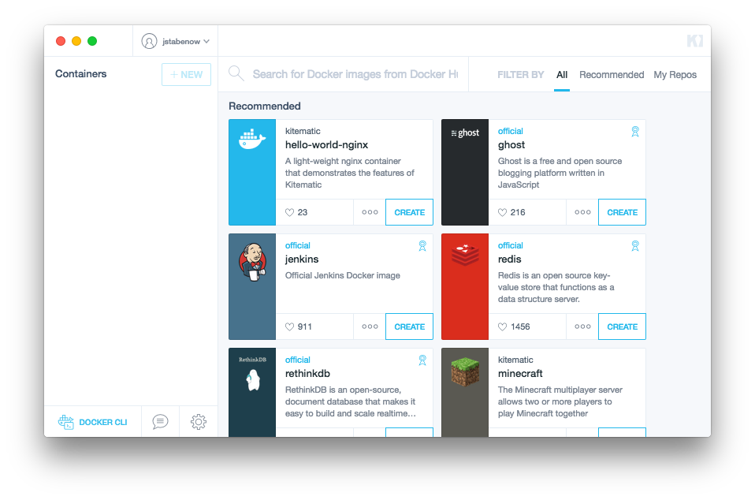
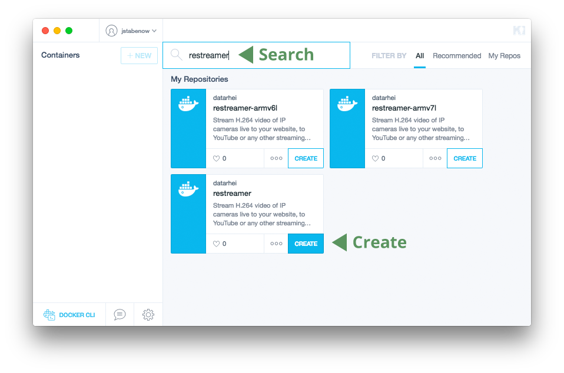
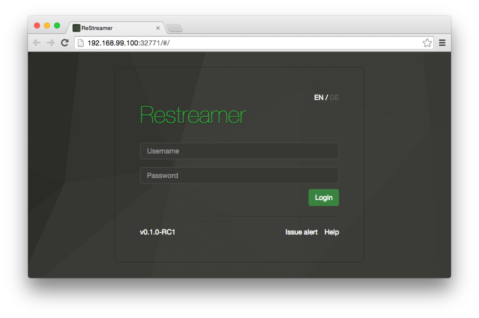
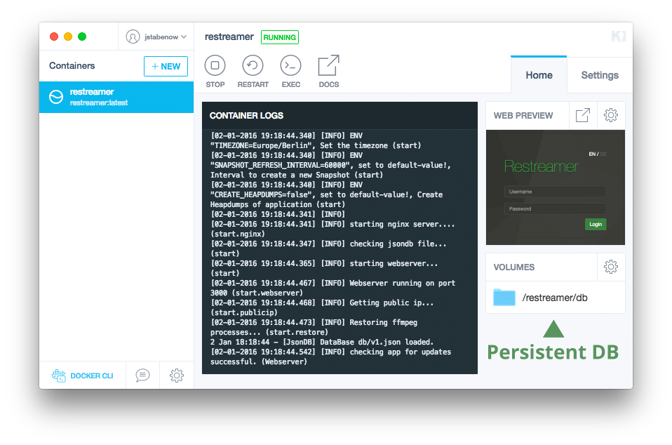
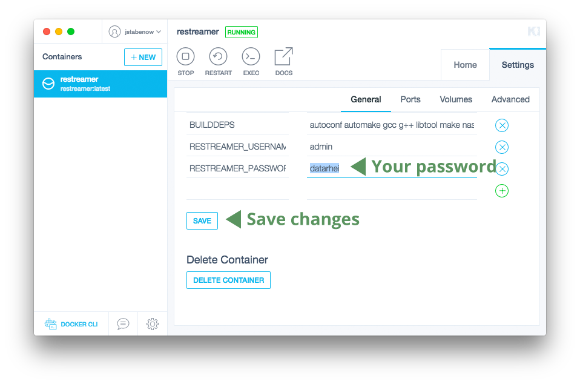
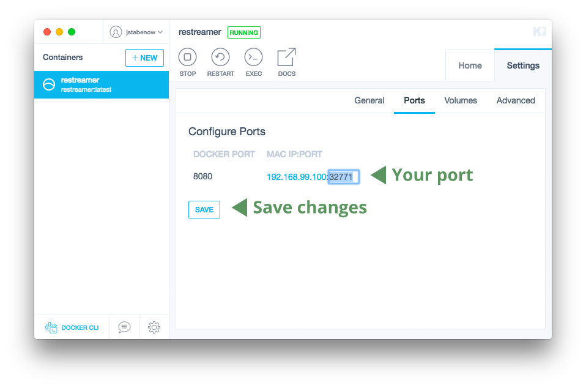
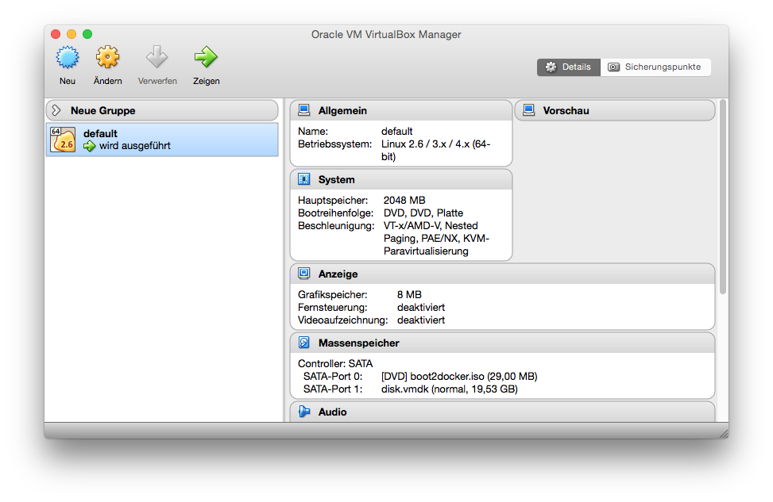
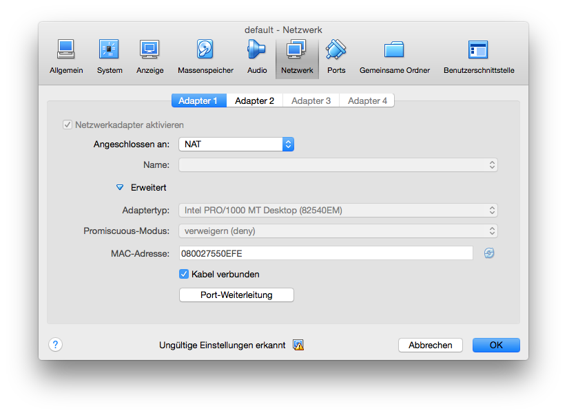

######[Installation](../docs/installation-index.html) > Installation OSX / Windows
# Installation OSX / Windows  

**Requirements:**  

* 64bit Intel or AMD CPU
* OSX 10.8+ (Mountain Lion or newer) or Windows 7+ (or later) 

---

## Installation

1. Download and install <a target= "_blank" href="https://www.docker.com/docker-toolbox/">**Docker Toolbox (Kitematic)**</a>. Skip the Kitematic login if you do not want to register at <a target= "_blank" href="https://hub.docker.com/">https://hub.docker.com/</a> 
2. Open the Kitematic User-Interface
   
3. Search for "restreamer" and select the "restreamer" image without "arm-"-tag
   
4. Finaly Kitematic is running the restreamer-container
   
5. Open the User-Interface by clicking on the web-preview
   
   
The default login (more [here](references-environment-vars.html#login-security)) are:

* Username: admin
* Password: datarhei

---

## Important customizations

1. Click on the volume path and "Enable volumes":
   
2. We recommend to change your password and username:
   

---

## Customs to embed the player upon your website

If you want to embed the video player on your website, you have to forward the port generated by Kitematic (Docker Toolbox) on your host-system and your router.
Next a small example for Kitematic/VirtualBox:

1. Select a custom port like 31000:
   
2. Open VirtualBox (look into your program-folder) and click upon the "default" machine on edit
   
3. Select the tab "network" and click on the button "port-forwarding"
   
4. Create a new rule and paste the copied port-number into "host-port" and "guest-port"
   
5. Save this changes by closing alls the windows with "OK"
6. Open the Restreamer upon your browser by "http://127.0.0.1:31000" to verify the changes

To setup the port-forwarding in your router model you have to read the manual.

---