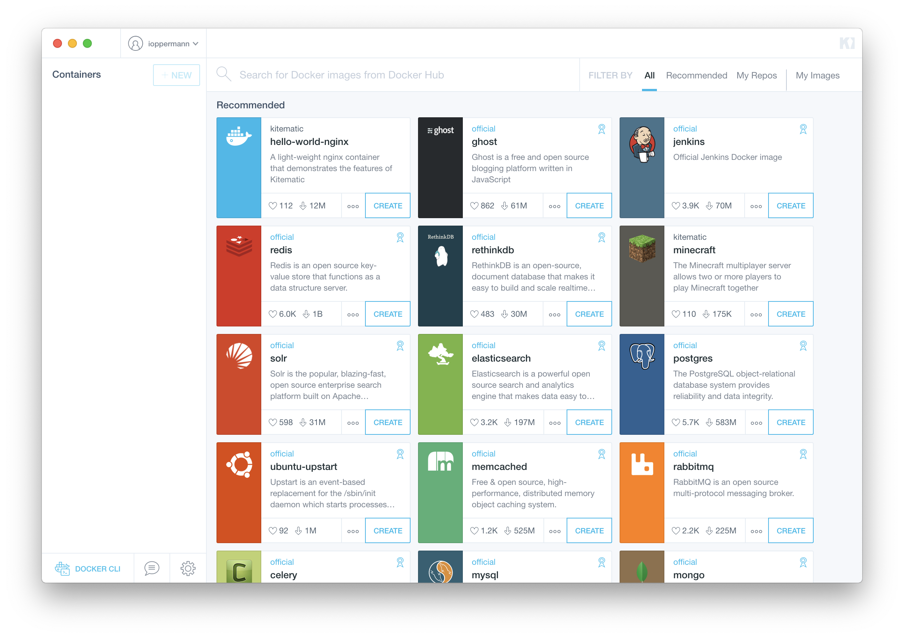
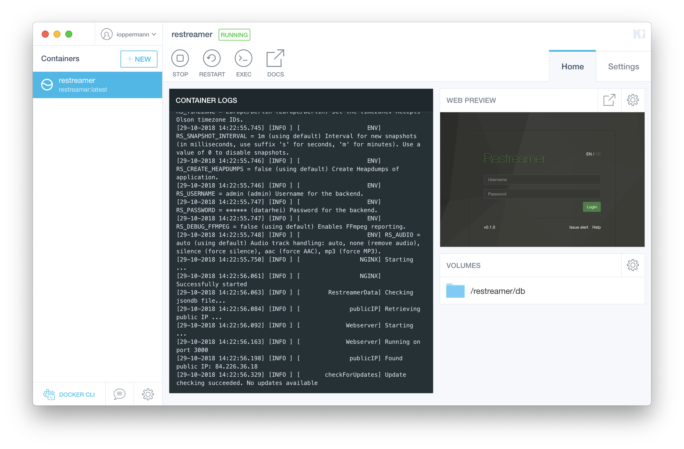
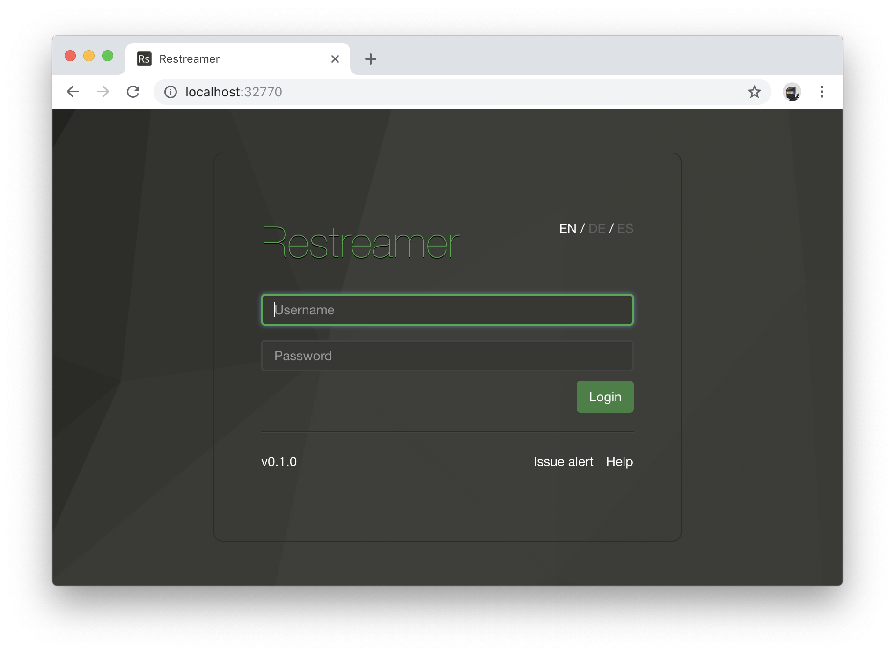
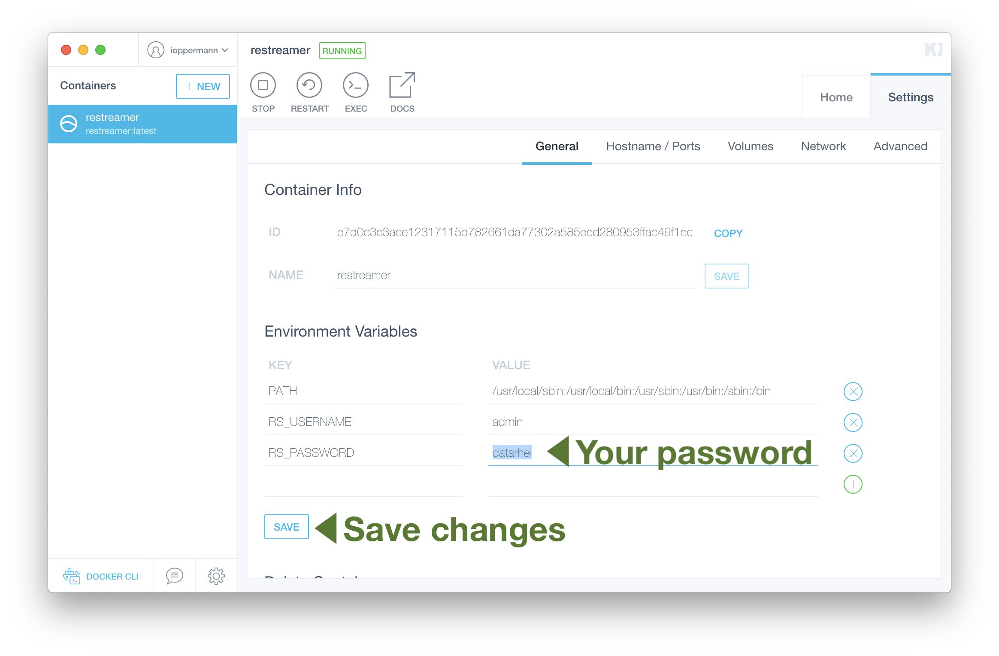
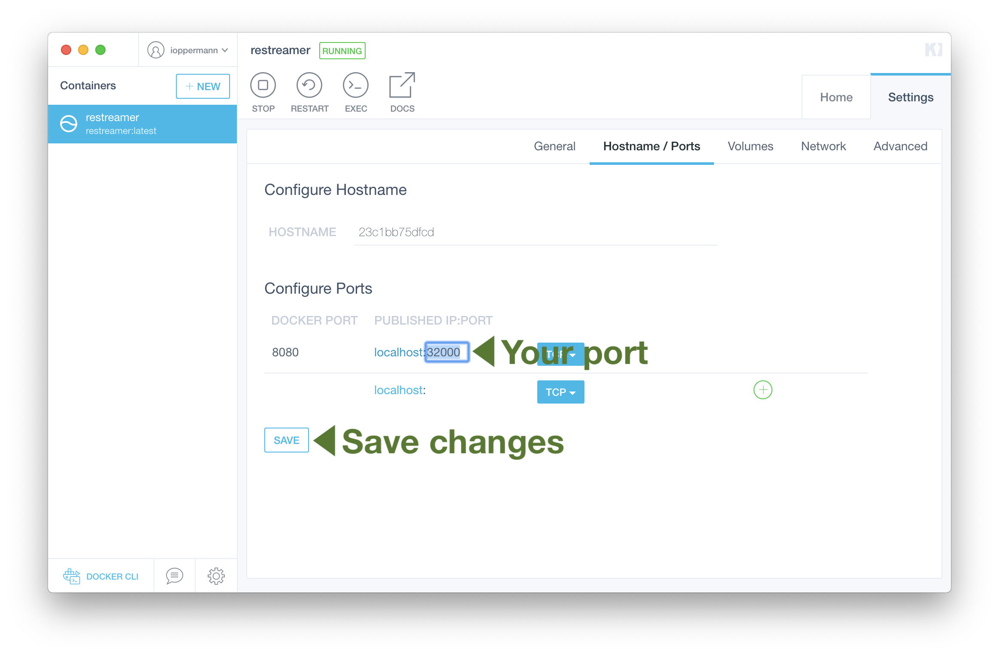

## Requirements

* 64bit Intel or AMD CPU
* OSX 10.10.3+ (Yosemite or later) or Windows 10 (Professional or Enterprise)

For other macOS or Windows versions, you can download the legacy [Docker Toolbox](https://docs.docker.com/toolbox/overview/).
{: .notice--info}

## Installation

1. Download and install [Docker Desktop](https://www.docker.com/products/docker-desktop). You have to login in order to start the download.
2. Open Kitematic
   
3. Search for "restreamer" and select the "restreamer" image without "arm-"-tag:
   
4. Finally Kitematic is running the Restreamer container:
   
5. Open the Restreamer user interface by clicking on "WEB PREVIEW":
   
   
The default login is:

* Username: `admin`
* Password: `datarhei`

It is highly recommended to change the username and password.
{: .notice--warning}

## Important customizations

1. Click on the volume path and "Enable volumes". This allows Restreamer to store the current state in a place where it can be restored when you restart the container:
   
2. We highly recommend to change your password and username:
   

## Customization to embed the player on your website

If you want to embed the video player on your website, you have to forward the port of Restreamer generated by Kitematic from your router to your host system.

1. Select a custom port like 32000:
   
2. Open the Restreamer in your browser by entering `http://127.0.0.1:32000` in the URL bar

3. To setup the [port forwarding](../wiki/portforwarding.html) in your router, please check your router's the manual.
