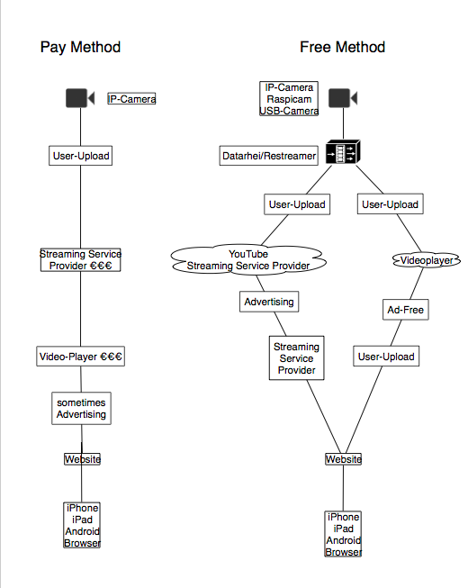
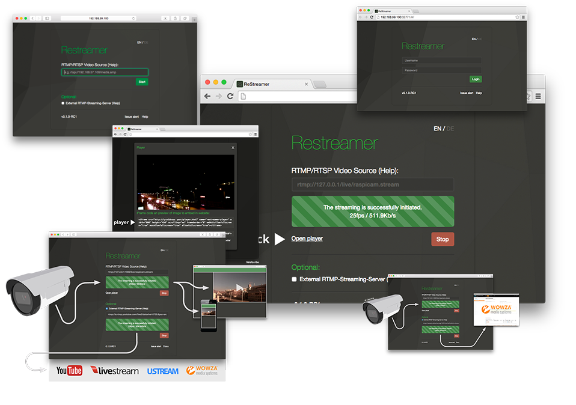

# Learn more
---
### What is Datarhei/Restreamer 

Datarhei/Restreamer is a software which allows for free real-time video streaming, e.g. transferring video signals of webcams or other video-inputs directly to your website. You can be your own Datarhei/Restreamer streaming provider.  

 

---
### How do I realise video streaming without Datarhei/Restreamer?  

The classic way is the data transfer with a streaming provider who collects monthly fees. Some services are supported by advertising, others additionally sell you their own hardware. Some companies then sell your live stream in content syndication campaigns, too. As a result you lose the control of your video content. The added value of the so-called "content syndication" is not measurable for you in most cases. Datarhei/Restreamer allows you to transfer H.264 video in TV quality to your own website without these middlemen. You are free to choose your hardware for yourself, the use is free of charge and you remain in possession of your videodata!  

 

---
### For whom is it suitable?  

Datarhei/Restreamer is suitable for all kinds of live video. Private and professional webcams for events or tourism marketing, in-house TV in hotels, restaurants, industrial and safety monitoring or surveillance are just a few applications. Only the number of viewers is limited. For a lot of viewers and professional applications you need background technology, you can easily connect to with Datarhei/Restreamer.  

 

---
### What is different from the "others"?  

Datarhei/Restreamer does not charge monthly fees and the streaming is completely free, because it uses your own internet connection. You will be your own video streaming provider. Datarhei/Restreamer is Open Source. It is free to use for both private and commercial use.

---