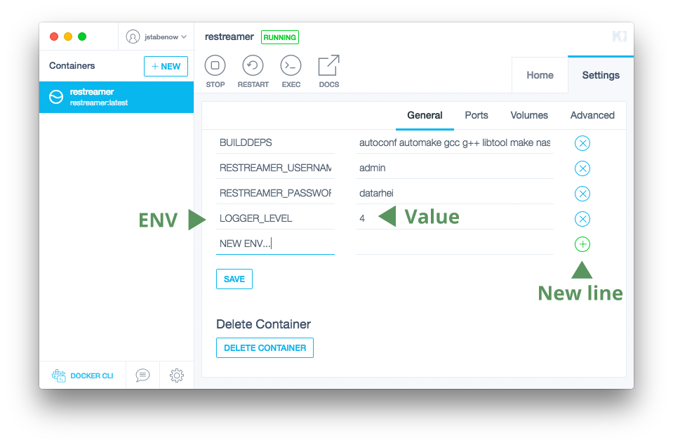

###### [References](references-index.html) > Enviroment Variables

# Enviroment Variables

You can control the default behaviour of the Datarhei/Restreamer with environment variables. Currently these environment variables are
understood and supported by Datarhei/Restreamer:

* `RS_SNAPSHOT_INTERVAL`

* [NodeJS Port](#nodejs-port)
* [Logger level](#logger-level)
* [Timezone](#timezone)
* [Login security](#login-security)
* [Snapshot refreash interval](#snapshot-refreash-interval)
* [Create heapdumps](#create-heapdumps)

**Shell example:**

```sh
export RS_LOGGER_LEVEL=4
export RS_SNAPSHOT_INTERVAL=10000
...

./run.sh
```

**Docker example:**

```sh
docker run ...
    -e "RS_LOGGER_LEVEL=4" \
    -e "RS_SNAPSHOT_INTERVAL=10000" \
        ...
```
**Kitematic example:**
   

---

#### NodeJS Port

Webserver port of the NodeJS application (nginx is proxying the port 8080 to 3000. don't change it without changing the nginx.conf too)   

Example:

```sh
"NODEJS_PORT=3000"
```

Default-Value: 3000

#### Logger level

Logs are shipped to stdout / stderr. With Kitematic click on the running container on the left sidebar or if you are using the shell, run "docker logs restreamer" to get it directly.

The env. "LOGGER_LEVEL" set the logging level of the application. The values are "1" for error, "2" for error and warnings, "3" for error, warnings and info or "4" for error, warnings, info and debug.

Example:   

```sh
"LOGGER_LEVEL=4"
```

Default-Value: 3

#### Timezone

Set the timezone for logging. More <a href="http://momentjs.com/timezone/" target="_blank">here</a>.  
Example:

```sh
"TIMEZONE=America/New_York"
```

Default-Value: Europe/Berlin

#### Login security

To change the default login data please change or set the following env. The auth out of [Configuration](references-config.html) are only as fallback.

Example:

```sh
"RESTREAMER_USERNAME=myUsername"
"RESTREAMER_PASSWORD=myVerySecurePassword"
```

Default-Values: admin / datarhei

#### Snapshot refreash interval

By default a snapshot is captured every 60 seconds. You can modify this by starting your Docker-Image with the additional command.
The 60000 is in msec. If you want to create a snapshot every 10 seconds you have to enter 10000.

Example:

```sh
"SNAPSHOT_REFRESH_INTERVAL=10000"
```

Default-Value: 60000

#### Create heapdumps (just for dev.)

Create Heapdumps of application (needs g++, make and python to run, please install heapdump with 'npm install heapdump' afterwords).

Example:

```sh
"CREATE_HEAPDUMPS=true"
```

Default-Value: false

---