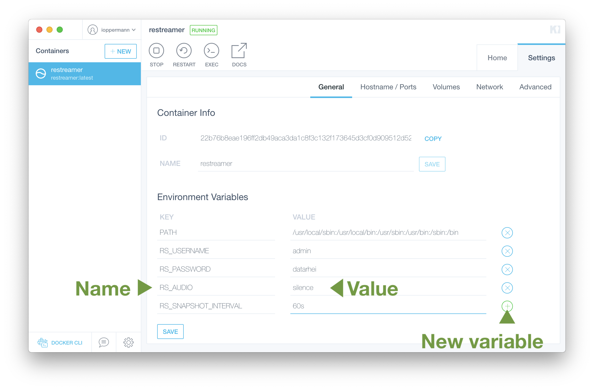

These environment variables enable you to control the default behaviour of Restreamer:

| Name | Default | Description |
|------|---------|-------------|
| `RS_USERNAME` | `admin` | Username for the backend. [Details](#rs_username) |
| `RS_PASSWORD` | `datarhei` | Password for the backend. [Details](#rs_password) |
| `RS_SNAPSHOT_INTERVAL` | `1m` | Interval for new snapshots. [Details](#rs_snapshot_interval) |
| `RS_AUDIO` | `auto` | Audio track handling. [Details](#rs_audio) |
| `RS_TOKEN` | (not set) | RTMP publish token. [Details](#rs_token)|
| `RS_HTTPS` | `false` | Enables HTTPS support for admin interface and embeddable player. [Details](#rs_https) |
| `RS_LOGLEVEL` | `3` | Logging level . [Details](#rs_loglevel) |
| `RS_TIMEZONE` | `Europe/Berlin` | Set the timezone. [Details](#rs_timezone) |
| `RS_DEBUG` | `false` | Enables debugging reporting. [Details](#rs_debug) |
| `RS_DEBUG_HEAPDUMPS` | `false` | Create heapdumps of application. [Details](#rs_debug_heapdumps) |
| `RS_NODEJS_PORT` | `3000` | Node.js webserver port of application. [Details](#rs_nodejs_port) |
| `RS_NODEJS_ENV` | `prod` | Node.js environment. [Details](#rs_nodejs_env) |
| `RS_MODE` | (not set) | Enable different input devices. [Details](#rs_mode) |
| `RS_INPUTSTREAM` | (not set) | Set default value for source stream. [Details](#rs_inputstream) |
| `RS_OUTPUTSTREAM` | (not set) | Set default value for external streaming server. [Details](#rs_outputstream) |

You can define new values for these environment variables in different ways, depending on how you run Restreamer.

**Shell example:**

```sh
export RS_LOGLEVEL=4
export RS_SNAPSHOT_INTERVAL=10000
...

./run.sh
```

**Docker example:**

```sh
docker run ...
    -e "RS_LOGLEVEL=4" \
    -e "RS_SNAPSHOT_INTERVAL=10000" \
        ...
```

**Kitematic example:**


**Docker Compose example:**

Change environment variables on your `docker-compose.yml` file
```sh
version: "3"
services:
  restreamer:
    image: datarhei/restreamer
    ...
    environment:
      - RS_LOGLEVEL=4
      - RS_SNAPSHOT_INTERVAL=10000
    ...
  ...
...
```
From your `docker-compose.yml` directory, execute
```sh
docker-compose up
```
or
```sh
docker-compose -f /path/to/docker-compose.yml up
```


## RS_USERNAME

Set the username for the Restreamer GUI login.


## RS_PASSWORD

Set the password for the Restreamer GUI login.

It is highly recommend to change the default password.
{: .notice--warning}


## RS_SNAPSHOT_INTERVAL

Set the interval in which the snapshot of the stream will be updated. The value should be in milliseconds. You can also
use a suffix to indicate the time unit. Known suffixes are `ms` for milliseconds, `s` for seconds, `m` for minutes.

In the following examples, the snapshot interval will be set to 1 minute:
```sh
export RS_SNAPSHOT_INTERVAL=60000
export RS_SNAPSHOT_INTERVAL=60000ms
export RS_SNAPSHOT_INTERVAL=60s
export RS_SNAPSHOT_INTERVAL=1m
```

The snapshot interval cannot be shorter that 10 seconds. If you provide a value smaller than this, the interval will
be set to the minimum of 10 seconds.
{: .notice--info}

If you want to disable the snapshots, use the special value of `0` for the snapshot interval.


## RS_AUDIO

By default the audio track from the incoming stream will not be modified. Only if the audio format is not supported by the
FLV container, the audio will be transcoded to AAC. If the incoming stream does not have an audio track, an empty AAC audio
track will be added. You can change this behaviour by providing one of the values to this environment variable:

| Value     | Description |
|-----------|-------------|
| `auto`    | Default behaviour  |
| `none`    | Remove any audio tracks |
| `silence` | Replace the audio track with silence or adds an empty AAC audio track |
| `aac`     | Transcode the audio track to AAC or adds an empty AAC audio track |
| `mp3`     | Transcode the audio track to MP3 or adds an empty MP3 audio track|

In the case of `silence`, an audio track will be added if the incoming stream doesn't have an audio track.

As of Restreamer version 0.4.0, this environment variable is deprecated and doesn't have any effect.
{: .notice--warning}


## RS_TOKEN

Set a token (just a string of characters, e.g. `eYIxCQpqzxr7`) that is required in order to push to the RTMP server. For pushing an RTMP
stream to the server you have to add the token as a key/value in the query string: `rtmp://127.0.0.1/live/camera.stream?token=...`.
By default the token is not set.


## RS_HTTPS

Whether to enable [HTTPS support](guides-https.html).


## RS_LOGLEVEL

Restreamer writes some information to the console (stdout). With this environment variable you can control how "chatty" Restreamer is.
The different logging levels are

| Value | Level   | Description |
|-------|---------|-------------|
| `0`   | `MUTE`  | No logging output |
| `1`   | `ERROR` | Only error messages will be logged |
| `2`   | `WARN`  | Warnings and error messages will be logged |
| `3`   | `INFO`  | Informal, warnings, and error messages will be logged |
| `4`   | `DEBUG` | Everything will be logged |

### Kitematic

Click on the running container on the left sidebar to see the logging output.

### Docker

Run `docker logs restreamer` to see the logging output.


## RS_TIMEZONE

Set the timezone for the timestamp in the logging messages. Allowed values are valid [timezone IDs](https://en.wikipedia.org/wiki/List_of_tz_database_time_zones).
E.g. `America/New_York`, `Europe/Berlin`, ... 


## RS_DEBUG

Set this value to `true` and the debugging output from the GUI and FFmpeg processes will be written to a file. You can access these files
through the browser in the path `/debug` of the Restreamer GUI, e.g. if your Restreamer GUI is running on `http://192.168.1.123/` then
the debug files will be under `http://192.168.1.123/debug`.

The logging output is very extensive. For a long running process it can use up a lot of disk space. This should only be used during development.
{: .notice--danger}


## RS_DEBUG_HEAPDUMPS

Set this value to `true` in order to create heap dumps of the Restreamer application. It needs `g++`, `make` and `python` to run and
you have to install heapdump with `npm install heapdump`.

This should only be used during development.
{: .notice--danger}
 

## RS_NODEJS_PORT

The port for the internal node.js webserver application. This port is not exposed to the outside.

NGINX is proxying the port 8080 to 3000.
{: .notice--info}

Please don't change this value without changing it in the `nginx.conf` accordingly. Otherwise Restreamer will not work correctly.
{: ..notice--danger}


## RS_NODEJS_ENV

Sets the enviroment for the Restreamer node.js application. Possible values are `prod` and `dev`.

This should only be used during development.
{: .notice--danger}


## RS_MODE

Enable either the Raspberry Pi camera (set a value of `RASPICAM`) or an USB camera (set a value of `USBCAM`) as an input
video stream. Don't set this environment variable if you want to use none of these devices.

Check out our [Raspberry Pi camera guide](guides-raspicam.html) or [USB camera guide](guides-usb-camera.html).


## RS_INPUTSTREAM

On a fresh Restreamer installation you can use this environment variable to set an URL for the RTSP, RTMP, or HLS source. This will also
automatically start the streaming from this source. On a later restart, this environment variable will be ignored.


## RS_INPUTSTREAM

On a fresh Restreamer installation you can use this environment variable to set an URL for the external streaming server. This will also
automatically start the streaming to this server. This environment variable will be ignored if `RS_INPUTSTREAM` is not set. On a later
restart, this environment variable will be ignored.
