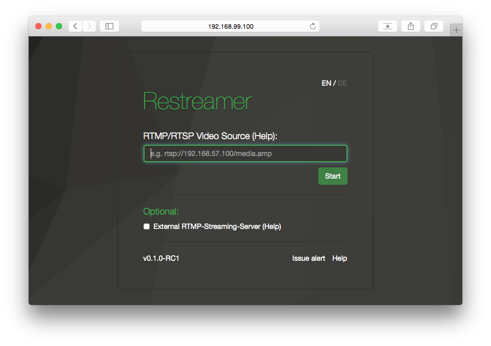

######[User Guides](../docs/guides-index.html) > RTMP/RTSP Video Source 
# RTMP/RTSP Video Source (IP camera)
For the integration of an H.264 enabled network camera you need the address, at which you can retrieve the video livestream from the camera. Take a look at your camera manual and look for RTSP/RTP.  

For this purpose, please read the manual of your camera and search for 0"RTSP". Alternatively you can find already many templates on the Soleratec company website: <a target= "_blank" href="https://www.soleratec.com/support/rtsp/rtsp_listing">https://www.soleratec.com/support/rtsp/rtsp_listing</a>  

**Two examples:**  
AXIS: rtsp://ip-address:554/axis-media/media.amp  
Samsung: rtsp://ip-address:554/profile2/media.smp  

*You can find the IP address of your camera, if necessary, in the DHCP table of your router. You can use a LAN scanner like http://angryip.org/ which displays all the devices on your network too if you are unsure what the correct IP address is*  

Next step: Put your rtsp-link in the "RTMP/RTSP Video Source" field in the Datarhei/Restreamer-Web-GUI.  

Last step: Start process  

Once the process has been successfully established, you can open the Datarhei/Restramer player and, if necessary, forward the stream to an external provider of the player.    

---