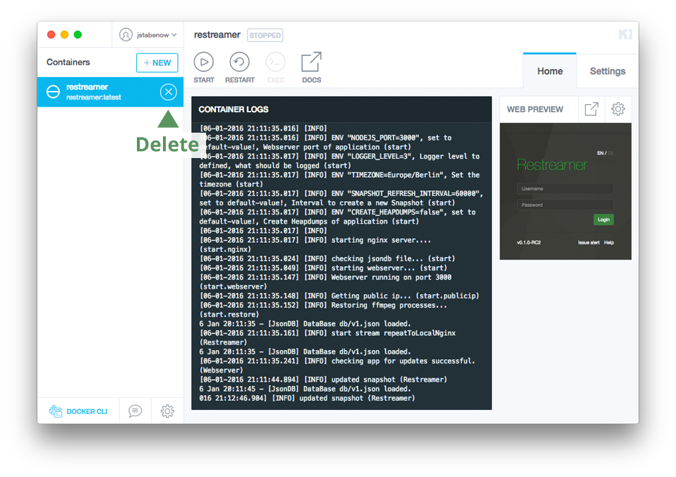
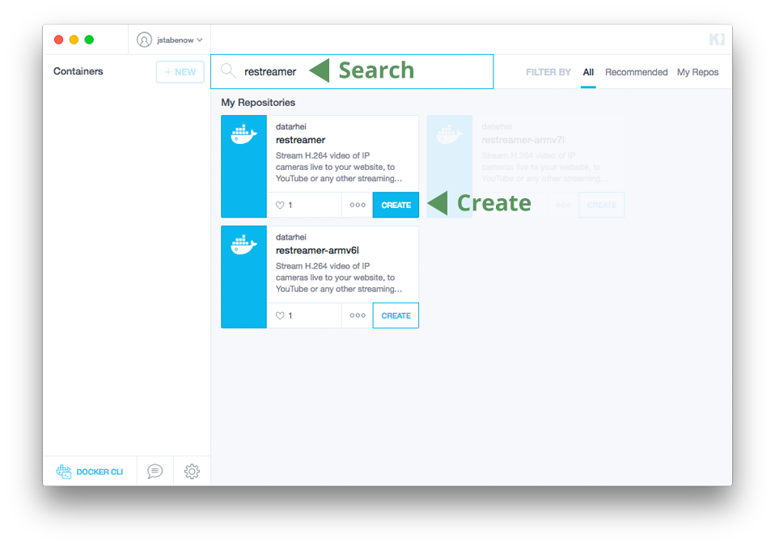
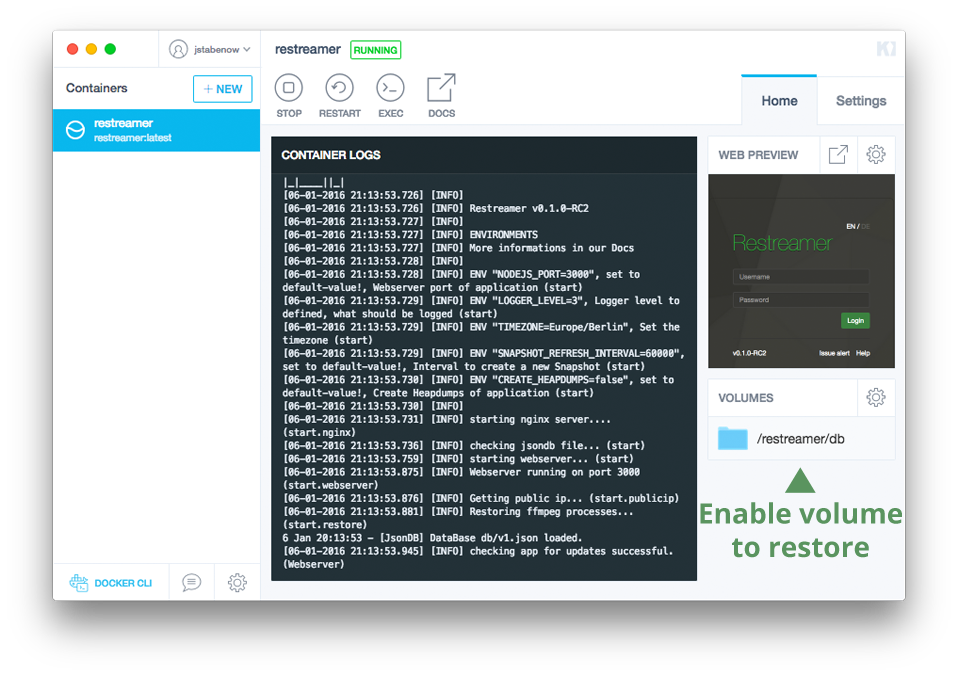

# Updates

To update the Restreamer without loosing the data of the input fields it is required to start the Docker-Image with `-v /path/to/local:/restreamer/db` ([here](installation-linux-64.html#declaration-of-the-command)) or a activated volume in Kitematic (Docker Toolbox) ([here](installation-osx-windows.html#important-customizations))!

* [OSX / Windows](#osx-windows)
* [Linux](#linux)

---

## OSX / Windows

1. open Kitematic and click in the running Restreamer on stop:
   
2. delete the old image:
   
3. start the image again: 
   
4. enable the volume again:
   
5. insert your enviroments again (more [here](installation-osx-windows.html#important-customizations))

That's it! 

---

## Linux

1.
  stop and remove the running Restreamer:   
  
   ```
   # docker stop restreamer && docker rm restreamer
   ```

2.
  download the new image. Please do not forget to add the right arm-tag if used.
  
   ```
   # docker pull datarhei/restreamer:latest  
   ```
   ```
   # docker pull datarhei/restreamer-armv6l:latest (use for Pi1)  
   ```
   ```
   # docker pull datarhei/restreamer-armv7l:latest (use for Pi2)  
   ```

3.
  start the Restreamer again (please remember to modify if you have your own configuration):   
   
   ```
   # docker run -d --name restreamer --restart always -e "RESTREAMER_USERNAME=YOUR-USERNAME" -e "RESTREAMER_PASSWORD=YOUR-PASSWORD" -p 8080:8080 -v /mnt/restreamer/db:/restreamer/db datarhei/restreamer:latest
   ```

Finished!

---

Want to talk to us? Write an email to <a href="mailto:open@datarhei.org?subject=Datarhei/Restreamer">open@datarhei.org</a>, go to [Support](../support.html) or choose a nickname speak to us in IRC: <a href="irc://irc.freenode.net#piwik">irc.freenode.net/#datarhei</a> (<a target= "_blank" href="https://webchat.freenode.net/?channels=datarhei">webchat</a>). You could ask a question in our (<a target= "_blank" href="https://groups.google.com/forum/#!forum/datarhei">Forum</a>) on Google Groups, too. If you're having a problem while developing, see <a target= "_blank" href="https://github.com/datarhei/restreamer/issues">Known Issues</a>.  
