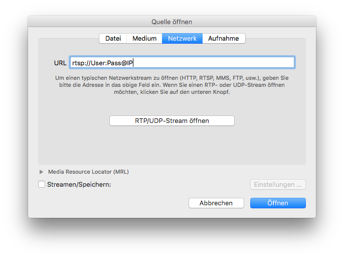

How to find the RTSP/RTP URL of your IP camera can be tricky. First browse to [this website](https://www.soleratec.com/support/rtsp/) and pick up your camera manufacturer and navigate to your camera model.

Please take care of the correct username and password if you deactivated anonymous RTSP/RTP in your camera. The syntax is: `rtsp://[username]:[password]@[camera IP and port]/ManufacturerLink`
{: .notice--warning}

## How to verify the RTSP/RTP URL on your local network with VLC:

1. Open VLC   
2. Open Network
3. Insert RTSP URL   

If you open the RTSP connection for the first time, it could take a few seconds until it opens - be patient!
If the stream did not open take a look at the VLC error message.
{: .notice--warning}
