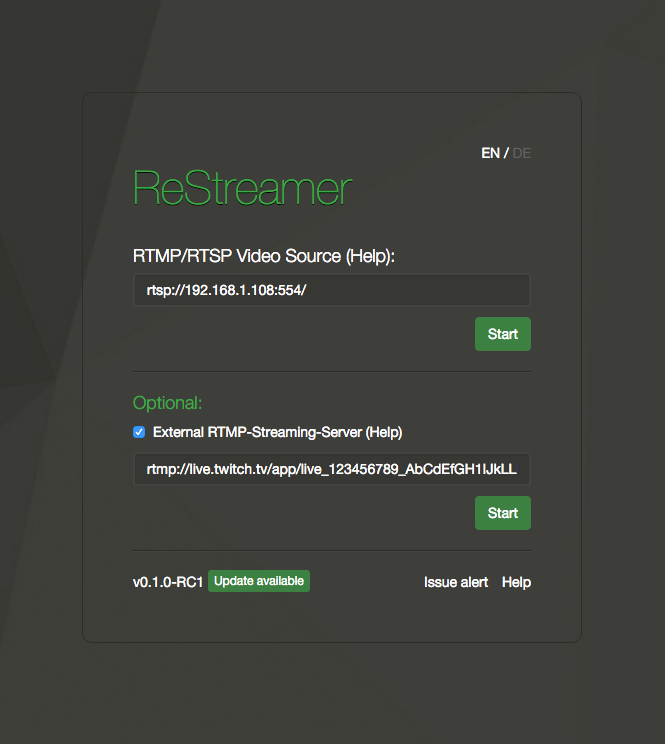

######[General Instructions](../wiki/general-instructions.html) > Livestreaming to Twitch.tv
#Livestreaming to Twitch.tv

**At first you need to register at [Twitch.tv](http://Twitch.tv) to use it!** 

A helpful start is a quick check of this link to the [Twitcht.tv broadcast requirements](http://help.twitch.tv/customer/portal/articles/1253460-broadcast-requirements).  

If you are familiar with Twitch.tv and the requirements open your Browser. Login to your user account and click to the:   
Dashboard. [http://www.twitch.tv/dashboard](http://www.twitch.tv/dashboard)  
Click: Stream Key  
Click: Show Key   
It shows something like: live_123456789_AbCdEfGH1IJkLLFoobar122345aA76baK8  

The static RTMP Twicht.tv URL you need is: rtmp://live.twitch.tv/app/  

The complete RTMP link with your unique ID looks like this: rtmp://live.twitch.tv/app/YourUniqueStreamKey  

The URL for your Datarhei/Restreamer with the example key would be: rtmp://live.twitch.tv/app/live_123456789_AbCdEfGH1IJkLLFoobar122345aA76baK8  

####Next steps to start the stream to Twitch.tv:  
open your Datarhei/Restreamer in your favourite Browser. connect your video device and START it (be safe that it works by opening the video player) 
activate External RTMP-Streaming-Server with the hook
put in the RTMP URL with your unique ID
click START to activate the video streaming to Twitch.tv